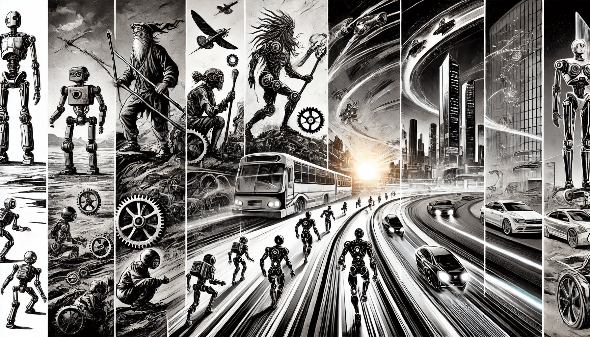

# History and Evolution of Robotics

Today robotics is a field that combines mechanical engineering, electronics, computer science, and artificial intelligence. Over the past century, robotics has developed from simple mechanical devices to highly advanced intelligent machines that support human work in industries, healthcare, defense, and even space. This chapter will explore the evolution of robotics, highlight key milestones, and explain how robotics is connected to modern AI and machine learning.

<figure><figcaption>
History and Evolution of Robotics
</figcaption></figure>

### The Early Ideas and Mechanical Beginnings

The idea of robots is not new. Long before computers or electronics, people imagined machines that could move and work like humans. In ancient Greece, the mathematician Hero of Alexandria built simple machines using air pressure and water flow. These early inventions were not true robots, but they showed a deep interest in automation.

In the 15th century, Leonardo da Vinci designed a mechanical knight that could sit, move its arms, and open its jaw. While this machine was never built at the time, the drawings are now seen as an early step in robotic design. These early machines were based only on mechanics and did not have sensors or decision-making ability.

### Industrial Age and the Birth of Automation

During the Industrial Revolution, factories began using machines to help with production. This was a key moment in the history of automation. The machines were not robots yet — they were powered by steam or electricity and had no control systems — but they showed how machines could replace some human labor.

In the 20th century, the development of electronics and computing opened the door for true robotics. &#x20;


**Did You Know?**\
The term "robot" was first used in 1920 by Czech writer Karel Čapek in his play R.U.R. (Rossum's Universal Robots). However, it was actually his brother, Josef Čapek, who invented the term. In Czech, robota means "forced labor" or "work done by peasants." The robots in the play were artificial people, not mechanical devices, but the idea strongly influenced future technology. Today, the word "robot" is used all over the world — even in languages where it originally had no meaning!


### The Rise of Modern Robotics

The real progress in robotics began after World War II, when advances in computing, sensors, and electronics made it possible to build machines that could sense and respond to their environment.

One of the first modern robots was created in 1954 by George Devol. It was called "Unimate" and was designed to perform simple repetitive tasks. In 1961, Unimate became the first robot to work on a factory assembly line at General Motors. This marked the beginning of industrial robotics.

From the 1970s onwards, companies in Japan, the United States, and Europe started developing more advanced robots for tasks like welding, painting, and material handling. These robots were programmable, meaning they could be reused for different tasks by changing the instructions they followed.

### Key Milestones in Robotics

Some important moments in robotics history include:

* **1961** – _Unimate_ begins work at a General Motors plant, becoming the first industrial robot.
* **1970s** – Robots become common in car manufacturing, especially in Japan.
* **1980s** – The first mobile robots with basic navigation skills are developed for research.
* **1996** – Honda introduces _P2_, a humanoid robot that can walk, which later becomes _ASIMO_.
* **2000s** – Domestic robots such as the _Roomba_ vacuum cleaner show that robots can enter homes.
* **2010s** – Drones, robotic exoskeletons, and surgical robots become more common and affordable.
* **2020s** – AI-powered robots can recognize faces, respond to speech, and learn from their environment.

### Case Study: Boston Dynamics and the Rise of Agile Robots

One of the most famous robotics companies today is **Boston Dynamics**, originally started as a spin-off from MIT in the 1990s. The company became well-known for developing robots that can walk, run, jump, and even dance.

One of their most popular robots is **Spot**, a four-legged robot that moves like a dog. Spot can climb stairs, walk over rough ground, and carry cameras or sensors. It has been used for inspection tasks on construction sites, in factories, and even in mines where it is dangerous for people to go.

Another Boston Dynamics robot, called **Atlas**, is a humanoid robot that can do backflips and navigate complex environments. What makes these robots special is their ability to move with **balance and agility**, using AI and real-time control systems. These systems allow the robots to respond to changes in the environment and keep moving, even when pushed or challenged.

This kind of mobility and independence shows how modern robotics is combining **mechanical engineering**, **sensor technology**, and **machine learning** to create machines that can truly work side by side with humans in the real world.

#### Robotics and Artificial Intelligence

Modern robotics is closely connected to AI and machine learning. A robot that only follows a fixed script is limited in what it can do. But a robot that can learn, adapt, and make decisions based on data is much more powerful. Machine learning helps robots recognize patterns, avoid obstacles, and even understand human emotions in some cases.

For example, autonomous vehicles (self-driving cars) are robots that use sensors, cameras, and AI to navigate streets. They must learn from traffic patterns, detect objects, and make decisions in real time. This level of robotics would not be possible without the support of machine learning algorithms and big data.

### The Future of Robotics

Robotics continues to evolve quickly. Today, robots are not just tools but partners in many industries. They assist doctors during surgeries, explore the deep ocean, and even work in space. With the rise of cloud computing, edge AI, and advanced sensors, the future of robotics will involve more intelligence, mobility, and cooperation with humans.

Ethical questions also arise: Should robots make decisions in place of humans? What jobs will disappear as robots take over more work? These are important topics for both engineers and society to consider.

***

In summary, the evolution of robotics reflects a deep human desire to extend our abilities through machines. From simple mechanical devices to intelligent systems, robotics has grown into a complex field that depends heavily on advances in AI and machine learning. As the field continues to progress, robotics will shape how we live, work, and even how we think about ourselves.
