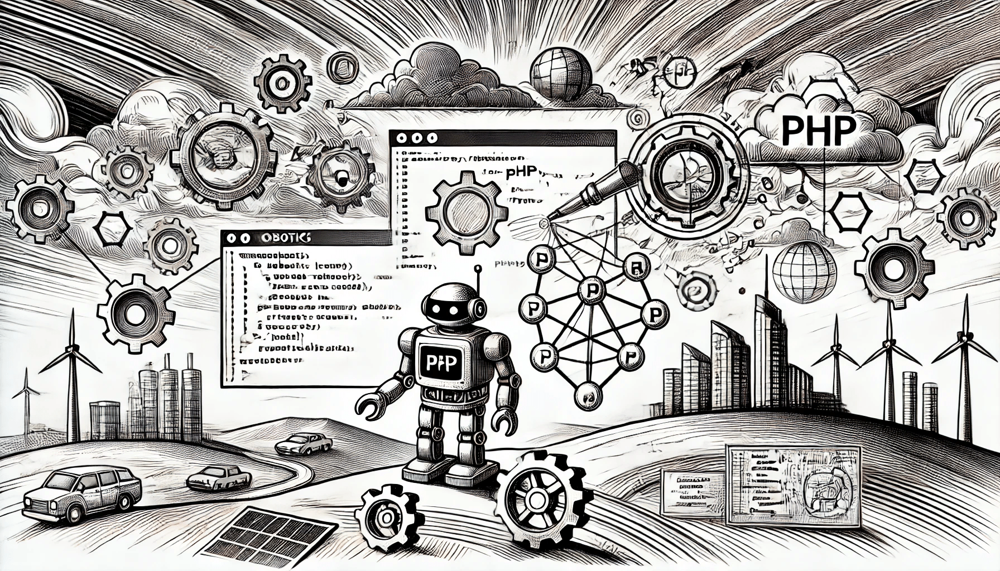

# Introduction

Robotics is an exciting and important field that combines mechanics, electronics, and intelligent software to create machines that can perform physical tasks in the real world. In the context of AI, robotics is the bridge between digital decision-making and physical action. Robots use AI to sense their environment, make decisions, and act in ways that are useful and safe.

<figure><figcaption>
Introduction to Robotics
</figcaption></figure>

### What is Robotics in the Context of AI?

When we talk about robotics in AI, we mean machines that are not only automated but also intelligent. Traditional automation follows fixed rules and works in a controlled environment. AI-powered robotics goes further. It uses sensors, data processing, and learning algorithms to understand and react to the world in real time.

For example, a simple robot vacuum can move around the house by avoiding obstacles. But a smart robot vacuum with AI can also map the house, remember locations of furniture, adjust its cleaning method based on floor type, and even schedule its tasks according to your habits. This kind of intelligence is possible because of the integration of AI techniques like computer vision, path planning, and reinforcement learning.

AI in robotics allows machines to be adaptive, interactive, and even predictive. These abilities are critical in fields like healthcare (surgical robots), logistics (automated warehouses), agriculture (autonomous tractors), and manufacturing (smart assembly lines).

### Why Robotics Matters in Modern AI Systems

The modern world demands systems that can think and act. While AI on its own can process data and make predictions, robotics gives AI a body — a way to interact with the physical world. This combination creates systems that are not just smart but also _capable_.

In self-driving cars, for example, AI handles visual recognition, lane detection, and decision-making, while robotics controls steering, acceleration, and braking. The success of the entire system depends on how well the software and hardware work together.

Robotics also plays a key role in human-robot interaction (HRI), where machines and humans cooperate in daily life or work environments. The robot must understand human behavior, speech, and motion, and respond in a natural way. AI enables this, but robotics makes it possible.

Furthermore, as AI models grow in complexity and power, we need platforms to deploy them outside of servers and screens. Robotics allows us to apply AI in the real world — from drone deliveries to robotic pets — and create practical value for people.

### Goals of This Section and What You’ll Learn

This section of the book will introduce you to the basic ideas of robotics with a focus on how AI techniques are used to make robots intelligent and autonomous. You will learn:

* What makes a robot “intelligent” and how AI supports robotic systems.
* Key AI techniques used in robotics such as perception, planning, and learning.
* Examples of real-world robots and their AI components.
* Ways to use PHP in web-based robotic systems or cloud integration.

We will also explore how sensors, actuators, and AI software come together to create interactive and responsive machines. You will see examples, learn about open-source platforms, and understand how robotics and AI are shaping the future.

### Additional Thoughts

Robotics is a challenging but highly rewarding area of AI. It requires working with both software and hardware, thinking in real time, and solving complex problems like navigation, manipulation, and interaction. As technology evolves, more robots will enter our homes, cities, and workplaces. Understanding how AI fits into these machines will prepare you for the future of intelligent systems.

In the next chapters, we will explore the components of a robotic system, understand how AI models are deployed on robots, and write some code that shows how PHP can interact with intelligent machines.
