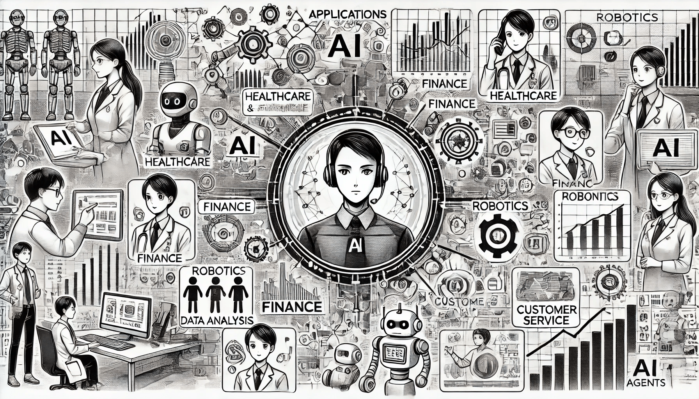

# Application of Agents in AI

AI agents are transforming a wide range of industries by automating tasks, optimizing complex processes, and enhancing user experiences. From self-driving cars to personalized shopping assistants, here are some of the most impactful applications of AI agents today.

<figure><figcaption>
Application of Agents in AI
</figcaption></figure>

### **1. Autonomous Systems**

Autonomous systems, including drones, robots, and self-driving cars, heavily rely on AI agents to navigate and make decisions in real time. These agents use sensor data, computer vision, and machine learning to operate safely and efficiently in dynamic environments.

* **Drones**: In agriculture, drones with AI agents monitor crop health, soil moisture, and pest populations. AI agents enable precise and autonomous navigation, allowing drones to adapt to changing weather or terrain for optimized coverage.
* **Robots in logistics**: Warehouse robots powered by AI agents are widely used in companies like Amazon. These robots navigate through complex layouts, sort and retrieve items, and avoid obstacles, significantly boosting efficiency and productivity.
* **Self-driving cars**: Companies like Waymo and Tesla employ AI agents to interpret road conditions, detect obstacles, and make complex driving decisions. By processing real-time data, these agents ensure safe and efficient driving, adapting to unexpected changes on the road.

### **2. Personal Assistants**

Intelligent personal assistants like Siri, Alexa, and Google Assistant use AI agents to understand and respond to voice commands. These agents perform tasks like answering questions, setting reminders, and controlling smart home devices, enhancing convenience and productivity in daily life.

* **Voice command execution**: Personal assistants use natural language processing (NLP) to understand and respond to spoken queries. For example, if you ask Siri to "play jazz music," it accesses music libraries to find relevant playlists.
* **Smart home integration**: AI agents in personal assistants control connected devices, such as adjusting thermostats or turning lights on and off. This creates a seamless, hands-free user experience, making homes more efficient and comfortable.

### **3. Gaming**

In gaming, AI agents control non-playable characters (NPCs), making games more interactive, dynamic, and challenging. These agents can adapt to players’ actions, strategize, and create a more immersive gaming experience.

* **NPC behavior**: NPCs controlled by AI agents act as lifelike opponents or allies. In action games, for instance, agents determine NPCs’ responses based on player behavior, adjusting tactics in real-time to increase difficulty and engagement.
* **Procedural content generation**: Some games use AI agents to generate content dynamically. For example, in open-world games, agents can design quests, challenges, or entire levels based on player actions, ensuring a unique experience for each user.

### **4. Smart Grids and Energy Management**

AI agents play a critical role in optimizing energy consumption and distribution in smart grids. By analyzing usage patterns and forecasting demand, these agents improve energy efficiency and sustainability.

* **Demand response**: AI agents in smart grids can predict peak usage times and automatically adjust supply or alert users to shift energy-intensive activities. This helps reduce strain on the grid and lowers energy costs.
* **Energy optimization**: Smart thermostats and home energy systems, like Google Nest, use AI agents to adjust heating or cooling based on occupancy and weather predictions, saving energy while maintaining comfort.

### **5. Healthcare**

In healthcare, AI agents are revolutionizing diagnostics, treatment recommendations, and patient monitoring. These agents analyze medical data to assist doctors and deliver personalized care to patients.

* **Diagnostics**: AI agents help identify diseases by analyzing imaging data (such as X-rays or MRIs). Systems like IBM Watson Health process large datasets to recommend diagnoses and treatments, supporting doctors in making informed decisions.
* **Personalized treatment recommendations**: Based on patient history and health data, AI agents suggest tailored treatment plans. This approach is particularly useful in oncology, where agents assist in selecting treatments that align with individual genetic profiles.

### **6. E-commerce**

In e-commerce, AI agents enhance customer experiences by offering intelligent shopping recommendations and personalized assistance, ultimately boosting engagement and sales.

* **Recommendation systems**: AI agents analyze users’ browsing and purchase history to suggest products. Amazon, for example, uses agents to recommend items similar to those viewed or bought, increasing the likelihood of repeat purchases.
* **Virtual shopping assistants**: Some e-commerce platforms use chatbots to assist customers in finding products. These agents answer questions, provide styling advice, and offer promotions, making the shopping experience more interactive and personalized.

From enhancing productivity in autonomous systems to personalizing user experiences in e-commerce, AI agents are shaping the future across multiple sectors. By automating complex tasks and delivering tailored solutions, they continue to push the boundaries of technology and provide significant value in our everyday lives.
