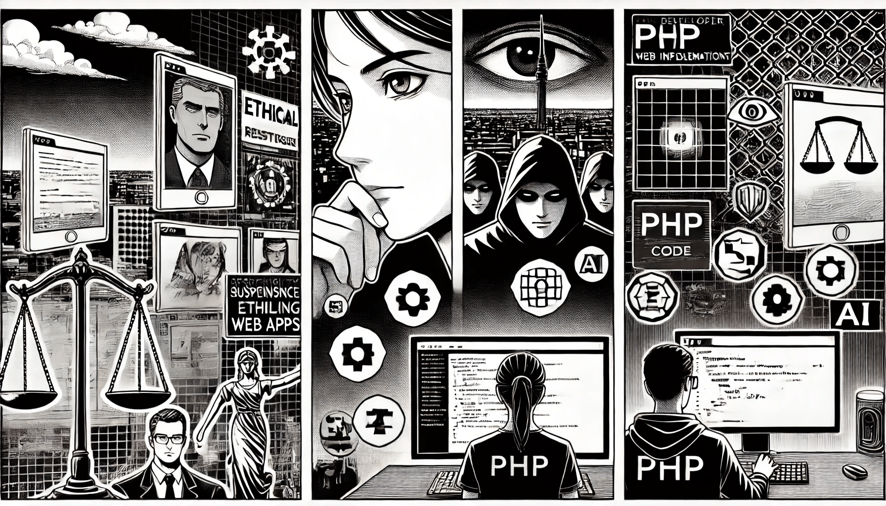

# Overview of AI Ethics

### **Why Ethics Matters in AI-Powered Web Apps**

AI is not neutral. It reflects the data it's trained on, the decisions made during its design, and the context in which it's deployed. When we embed AI into PHP-based applications — whether for content moderation, personalization, fraud detection, or chat support — we introduce a system that makes decisions on behalf of users.

<figure><figcaption></figcaption></figure>

These decisions can impact real lives. For instance, a poorly trained model might unfairly block user content, misidentify behavior as malicious, or promote biased outcomes. This isn't just a technical problem — it's a human one.

Ethics in AI isn't just for researchers or policymakers. As a developer, you're often the last line of defense. How you structure your app, how you handle data, and how you design AI-powered features can mean the difference between empowering users and violating their trust.

Building ethical AI-powered web apps is ultimately about ensuring:

* **Fairness**: Avoiding bias and discrimination in outcomes.
* **Transparency**: Helping users understand how decisions are made.
* **Privacy**: Respecting user data and consent.
* **Accountability**: Logging decisions and offering recourse when things go wrong.

Ignoring these factors can result in public backlash, legal issues, or loss of trust — none of which are good for business or for society.

### **Ethical Risks in Web-Based AI Applications**

Let’s break down the most common ethical pitfalls you might encounter when integrating AI into PHP web applications:

* **Surveillance and Overreach**: AI systems can analyze behavior at scale — often beyond what's necessary. Logging too much data or monitoring users without consent erodes privacy and trust.
* **Profiling and Discrimination:** AI systems trained on biased or outdated data can repeat or even worsen social unfairness. For instance, a spam filter might wrongly flag more messages from people of a certain background if the data it learned from was biased.
* **Manipulation and Dark Patterns:** Tools like personalization engines, recommendation systems, and chatbots can quietly push people to do certain things. If they're used to convince people instead of helping them, it becomes unethical.
* **Lack of Oversight**: AI systems can become "black boxes", where even developers don't fully understand how decisions are made. This opacity is especially dangerous in high-impact domains like security or finance.
* **Automation of Harm**: Automated moderation or customer support powered by AI can mistakenly block access, ignore nuance, or escalate conflict if not properly supervised.

When working in PHP, you may not be building the model yourself — but you're likely handling model input, output, and user interactions. That's where a lot of the risk (and responsibility) lies.

### **The Developer's Role in Ethical AI**

Ethical AI is not just a data science issue. It's also an engineering issue — especially for developers responsible for deploying models and handling user interactions in production systems.

As a developer, your responsibilities include:

* **Input validation**: Ensuring that the data being passed to AI models is clean, expected, and appropriate.
* **Contextual filters**: Deciding when and how to use AI-generated outputs in your application (e.g., don’t auto-publish content flagged as high-risk).
* **Auditing and logging**: Building systems that track what the AI did, when, and why — so that issues can be diagnosed later.
* **Feedback mechanisms**: Letting users report issues, flag content, or opt out of automated decisions.
* **Policy enforcement**: Enforcing rate limits, access controls, and terms of use to prevent abuse.

Ethical AI is built as much through backend logic as it is through training data. How you implement decision points, how you structure fallback mechanisms, and how you communicate with the user all influence how your AI is perceived — and whether it causes harm.

In short, you have the power to build AI features that are not just smart, but responsible. The rest of this section will show you how.
