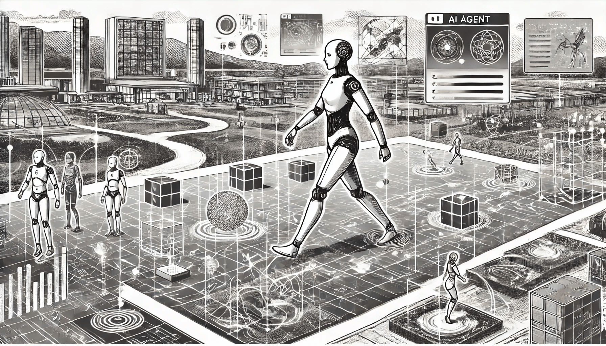

# AI Agent Environment

Artificial Intelligence agents operate within various environments that dictate how they perceive, interact, and succeed in accomplishing tasks. Understanding these environments is critical for designing effective AI systems. According to **Russell** and **Norvig**, environments can be characterized by specific features, each affecting how agents perceive and act within them. Here, we will explore these features with examples and explain how agents adapt their perception and actions to each environment type.

<figure><figcaption>
AI Agent Environment
</figcaption></figure>

### Features of Environment

When designing intelligent agents, understanding the environment is essential for determining how they will perceive, act, and learn. As per Russell and Norvig’s framework in _Artificial Intelligence: A Modern Approach_, environments vary across several characteristics. These features impact an agent’s behavior and dictate the methods and algorithms used to achieve goals. Let's take a closer look at each characteristic.

### 1. Fully Observable vs Partially Observable

An observable environment determines how much information an agent can obtain about its current state.

An environment is fully observable if an agent can access all the relevant information about the current state at any time. In fully observable environments, agents operate without uncertainty, making it easier to devise straightforward strategies. For example, in a board game like chess, an agent can observe the entire board, knowing the position of all pieces.

* **Example**: In a chess game, the AI perceives the entire board, which allows it to predict every possible opponent move. This transparency enables strategic planning since the agent does not need to guess or infer any missing information.
* **Agent Perception and Action**: Here, the agent can use direct observations to construct a complete world model, eliminating the need for probabilistic reasoning. The agent acts based on this fully informed perspective, enabling sophisticated, deterministic strategies.

In contrast, partially observable environments provide only limited or noisy information, creating uncertainty about the state. Agents in such settings must often make predictions or rely on past observations to infer missing data. A self-driving car is an example, as it perceives its surroundings through sensors that may be blocked by obstacles or limited by poor lighting, necessitating predictive algorithms to navigate safely.

* **Example**: A self-driving car operates with partial visibility, relying on sensor data that can be limited by blind spots or low-light conditions. It must infer and predict potential hazards to ensure safe navigation.
* **Agent Perception and Action**: The agent must rely on past observations, probability models, or internal memory to fill in information gaps, adapting its actions based on the estimated state of the environment. This often includes making cautious or conservative choices to manage uncertainties.

### 2. Static vs Dynamic

The dynamic aspect of an environment is based on how much it changes over time, with or without the agent’s intervention.

A static environment remains constant during the agent’s operation, allowing it to plan actions without concern for changes in the environment. Static environments are simpler, as agents can make decisions without needing to update their information. Puzzle games, where the environment doesn’t change once a puzzle starts, are classic examples of static environments.

* **Static** **Environment**: In a static environment, the world remains unchanged while the agent is deciding or performing actions, allowing more precise, calculated decisions.
* **Example**: In a crossword puzzle, the agent analyzes the static board to determine which words fit into the given spaces without external interference. \\

In a dynamic environment, however, changes occur independently of the agent, requiring it to adapt continuously. Dynamic environments demand that agents react quickly and often make decisions based on incomplete data. For example, a stock-trading algorithm must operate in a dynamic environment where market prices fluctuate continuously, and decisions are time-sensitive.

* **Example**: A stock-trading AI must continuously monitor fluctuating market prices and adapt its strategies in real time to maximize profit or minimize risk.
* **Agent Perception and Action**: In such environments, the agent must continuously perceive changes and immediately respond. The agent’s actions may include adaptive strategies or probabilistic modeling to react to unpredictable or rapid shifts.

### 3. Discrete vs Continuous

The discreteness or continuity of an environment pertains to the nature of possible states and actions.

In a discrete environment, there is a finite set of distinct states and actions. This allows for structured and often simpler decision-making since an agent can map out actions in advance. Games like tic-tac-toe are discrete, as the agent has only a limited number of moves and board configurations to consider.

* **Example**: In tic-tac-toe, the AI agent analyzes each square and the limited set of moves for precise decisions.
* ֿ**Agent Perception and Action**: The agent perceives discrete states and maps actions to these specific possibilities, resulting in a structured decision-making process. It calculates optimal moves based on predictable outcomes and limited state spaces.

Continuous environments, on the other hand, have an infinite range of possible states and actions. Agents in continuous environments, such as a robotic arm adjusting its position, require more sophisticated algorithms to make gradual adjustments. Continuous settings often demand more precise calculations and real-time control to achieve smooth actions.

* **Example**: A drone navigating through open air continuously adjusts its path based on factors like altitude, speed, and wind conditions.
* **Agent Perception and Action**: Here, the agent must make ongoing, fine-grained adjustments to its perception and actions. Instead of discrete state mapping, it relies on mathematical models and real-time sensor data to maintain control and navigate effectively.

### 4. Deterministic vs Stochastic

An environment’s predictability affects how certain or uncertain an agent’s actions are regarding outcomesץ

In deterministic environments, each action leads to a specific, predictable outcome, reducing the complexity of decision-making. Since no randomness is involved, agents can plan optimal actions with certainty. A Sudoku puzzle is deterministic because placing a number in a certain cell produces an exact outcome without variability.

* **Example**: In Sudoku, each number placement produces a predictable result, allowing the agent to plan moves without accounting for uncertainty.
* **Agent Perception and Action**: The agent can act with certainty, making decisions based solely on the desired end state. Since the environment is predictable, agents can execute plans with high confidence.

In stochastic environments, however, outcomes are influenced by randomness or uncertainty, making predictions more complex. For instance, a weather-forecasting AI operates in a stochastic environment where outcomes depend on various unpredictable factors. Agents in such environments rely on probabilistic models or machine learning to estimate likely outcomes.

* **Example**: In weather forecasting, AI perceives data like temperature and pressure but must account for unpredictable changes.
* **Agent Perception and Action**: The agent uses probabilistic models, interpreting its observations through likelihood estimations to guide actions. Actions are usually designed to maximize expected outcomes or minimize risks.

### 5. Single-Agent vs Multi-Agent

This feature considers whether the agent interacts alone or with other agents:

A single-agent environment involves only one decision-maker, focusing solely on the agent’s objectives. Robotic vacuums work in single-agent environments as they operate alone, interacting only with obstacles in their path.

* **Example**: A robotic vacuum operates in isolation, perceiving obstacles and optimizing its path without interference.
* **Agent Perception and Action**: The agent can concentrate solely on achieving its objectives, optimizing for efficiency. It perceives obstacles and navigates paths without considering others’ actions or goals.

Multi-agent environments, by contrast, involve multiple agents, which may compete or cooperate with each other. Each agent must consider the actions of others, adding complexity to decision-making. In a multiplayer strategy game, for example, each agent (player) needs to adapt to opponents’ strategies, often using game-theory-based reasoning.

* **Example**: In a strategy game like StarCraft, an AI must anticipate and counter opponents’ strategies.
* **Agent Perception and Action**: The agent continuously evaluates the actions of other agents, adapting its decisions dynamically. This may include cooperative tactics or counter-strategies, requiring the agent to stay alert to others’ moves.

### 6. Episodic vs Sequential

The episodic or sequential nature of an environment reflects how actions relate across time:

Episodic environments allow agents to make decisions in isolated episodes without concern for the impact on future states. Each action is self-contained, and decisions don’t have long-term consequences, as seen in image classification tasks, where each classification is independent of previous or future classifications.

* **Example**: Image classification is episodic; the agent classifies each image independently without considering previous or future images.
* **Agent Perception and Action**: The agent perceives each instance independently, focusing on maximizing accuracy per instance without concern for long-term dependencies.

Sequential environments require agents to consider how current actions will affect future states. In a game like chess, each move changes the board, impacting subsequent moves and strategies. Agents in sequential environments use planning and look-ahead strategies to balance immediate and long-term rewards.ֿ

* **Example**: In a chess game, each move influences subsequent moves, demanding a long-term strategy.
* **Agent Perception and Action**: The agent plans sequences of actions, balancing immediate benefits with long-term goals. It perceives not only the current state but also how actions might shape future scenarios.

### 7. Known vs Unknown

The knowledge aspect of an environment pertains to the agent’s prior understanding of the environment’s laws and dynamics:

Known environments are those in which the agent has full knowledge of all rules, states, and dynamics, allowing it to plan effectively from the start. A chess game is a known environment because all rules and outcomes are understood, enabling the agent to calculate moves precisely.

* **Example**: A board game like checkers has known rules, allowing the agent to map each possible move precisely.
* **Agent Perception and Action**: The agent perceives with complete understanding, focusing on finding the optimal strategy without needing to explore or learn from interactions.

Unknown environments, however, contain hidden dynamics that the agent must learn through interaction. This requires exploration-based strategies, as seen in autonomous robots learning to navigate new terrain. Agents in unknown environments use trial-and-error learning to gradually understand the environment.

* **Example**: In a new, complex video game, an AI may not initially know how the environment works and must experiment to learn the rules and objectives.
* **Agent Perception and Action**: The agent uses exploration-based strategies, learning from its interactions. Actions are chosen to maximize learning initially, shifting to goal-directed behavior as it gains familiarity with the environment.

### 8. Accessible vs Inaccessible

The accessibility of an environment is determined by the extent to which an agent can interact with or perceive it:

In an accessible environment, the agent has access to all necessary data to make fully informed decisions. Online games that display all information on-screen to players are accessible environments because no information is hidden.

* **Example**: An online chess platform with a clear, complete display of the board state is accessible to the AI, providing all required data for strategy.
* **Agent Perception and Action**: The agent fully understands the environment, focusing on interpreting available data to make optimal choices. Actions reflect a fully-informed decision-making process.

An inaccessible environment restricts access to crucial data, challenging agents to infer missing information. For instance, in medical diagnosis, an AI may lack complete patient data, forcing it to make predictions based on partial information. Agents in inaccessible environments often use inferential reasoning to fill in data gaps and make decisions under uncertainty.

* **Example**: A medical diagnosis system may operate with incomplete patient data, forcing it to make informed predictions.
* **Agent Perception and Action**: The agent uses statistical models or inferred reasoning to supplement missing information, adopting cautious or probabilistic actions to manage uncertainty.

### Conclusion

Understanding these environmental features helps in designing tailored AI agents that can optimally perceive, reason, and act based on their surroundings. Russell and Norvig’s classification provides a foundational framework for categorizing environments, ultimately guiding the development of more effective and intelligent AI systems.
