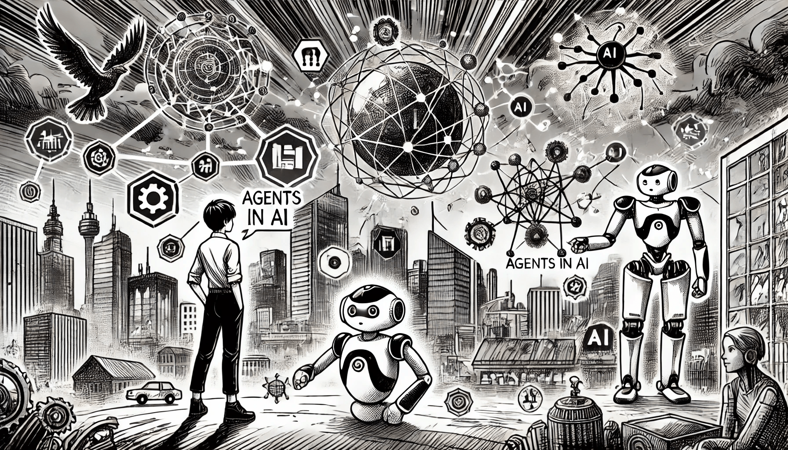

# AI Agents

Imagine a world where machines aren’t just following commands, but are actively thinking, adapting, and making decisions. Welcome to the realm of agents in artificial intelligence, where programs are built to perceive their surroundings, make choices, and take action—all without direct human control. Think of them as the brain behind smart systems, from virtual assistants to robots.

<figure><figcaption>
AI Agents
</figcaption></figure>

