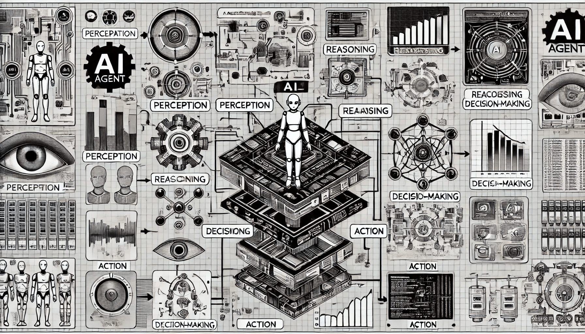

# AI Agent Architecture

In the design of AI agents, architecture is crucial in determining how an agent perceives, decides, and acts in its environment. There are three primary architectures in AI agents: **Reactive**, **Deliberative**, and **Hybrid**. Each has unique characteristics that suit different applications, from real-time response systems to strategic decision-making.

<figure><figcaption>
AI Agent Architecture
</figcaption></figure>

### **1. Reactive Architecture**

Reactive architectures are the simplest form of AI agent design. These agents respond directly to environmental stimuli without any internal memory or reasoning process. They rely on a set of pre-programmed rules or mappings that determine their responses based on input alone.

This architecture is highly effective in fast-paced or unpredictable environments, where immediate reactions are critical. For example:

* **Self-driving car obstacle avoidance**: In autonomous vehicles, reactive systems detect immediate obstacles like pedestrians or other cars. These reactions, based on sensor data, allow the car to respond instantly without complex planning.
* **Warehouse robots**: Robots like those in Amazon’s warehouses use reactive rules to navigate aisles, avoid obstacles, and pick items without analyzing future steps. They only need basic sensory data and straightforward decision rules for efficient real-time operation.
* **Stock trading bots**: In financial markets, reactive trading bots operate by analyzing real-time price changes and executing trades instantly based on preset criteria, such as buying when a stock drops below a certain threshold.

While reactive agents are fast and efficient in handling straightforward tasks, they lack the ability to adapt, learn, or plan for future actions. As a result, their responses can be limited when encountering unfamiliar or complex scenarios.

### **2. Deliberative Architecture**

Deliberative architectures, also known as **goal-driven** or **model-based systems**, allow agents to reason about their actions using an internal model of the environment. This model enables agents to make decisions based on goals, plans, and expected outcomes, leading to more strategic and calculated behaviors.

These agents are particularly useful in applications requiring careful planning and foresight, where responses need to align with long-term goals. Some examples include:

* **Autonomous Mars rovers**: NASA’s rovers, such as **Curiosity**, utilize deliberative architectures to plan routes and make strategic decisions about exploration. By evaluating terrain and energy constraints, they can set and execute goals, like moving toward a geological target.
* **Medical diagnosis systems**: Deliberative agents in healthcare use patient data, symptoms, and medical knowledge bases to assess possible diagnoses, recommend treatments, and predict patient outcomes. This planning-based approach is crucial for complex and nuanced decision-making.
* **Chess-playing AI**: Games like chess require agents to think ahead and evaluate potential moves. Deliberative architectures allow chess AI to simulate many possible scenarios, make calculated moves, and develop long-term strategies, as seen with **Deep Blue**’s historical matches.

While deliberative agents are highly capable of complex decision-making, they are often computationally intensive. Their need for real-time processing can become a limitation in scenarios where quick responses are essential.

### **3. Hybrid Architecture**

Hybrid architectures combine elements of both reactive and deliberative systems, leveraging the strengths of each to create agents that can respond quickly to stimuli while still having the capacity for strategic planning. In this design, an agent might use a reactive layer for instant responses and a deliberative layer for high-level goal setting and planning.

This approach is ideal for environments that require both immediate actions and long-term strategies. Examples include:

* **Humanoid robots**: In applications like rescue missions, hybrid robots need to react quickly to obstacles while also planning routes to reach trapped survivors. The reactive layer handles sudden obstacles, while the deliberative layer works on pathfinding and navigation toward the rescue site.
* **Intelligent personal assistants**: Virtual assistants like **Siri** or **Google Assistant** are designed with hybrid architectures. For simple commands like setting a timer, they react instantly. For more complex tasks like scheduling a day based on user preferences and meetings, they use deliberative planning to consider multiple factors and provide personalized responses.
* **Autonomous drones for surveillance**: Drones equipped with hybrid architectures can avoid immediate threats, like birds or power lines, while also maintaining a set patrol route. The reactive system manages real-time flight adjustments, while the deliberative system ensures the drone completes its designated path.

Hybrid agents are versatile and adaptive, combining the speed of reactive responses with the depth of deliberative planning. This dual-layered approach makes them suitable for complex, real-world environments where both agility and foresight are critical.
