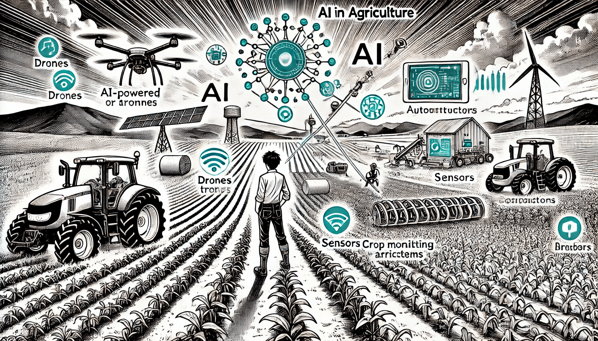

# AI in Agriculture

### Cultivating Smarter and More Efficient Farming

Artificial Intelligence is transforming agriculture by enabling more efficient, sustainable, and data-driven farming practices. As global demand for food increases, AI is helping farmers optimize their processes, reduce waste, and increase yields. From precision farming to predictive analytics, AI is becoming a vital tool in addressing the challenges of modern agriculture. Let’s explore how AI is reshaping the way we grow, manage, and harvest crops.

<figure><figcaption>
AI in Agriculture
</figcaption></figure>

### Precision Farming

Precision farming is one of the most significant applications of AI in agriculture, where AI technologies help farmers make better decisions about when, where, and how to plant, irrigate, and harvest crops. By analyzing data from various sources, including sensors, satellite imagery, and drones, AI can provide real-time insights that improve farm management.

For example, **John Deere** uses AI in its farming equipment to help farmers optimize planting by analyzing soil conditions and ensuring seeds are planted at the ideal depth and spacing. Similarly, **Blue River Technology**, a company acquired by John Deere, developed the **See & Spray** system, which uses AI to detect weeds and spray herbicides only where needed, significantly reducing the amount of chemicals used and lowering costs for farmers.

### Predictive Analytics and Crop Monitoring

AI is also being used to monitor crops and predict their growth, helping farmers anticipate issues like disease, pests, or unfavorable weather conditions before they become significant problems. By using machine learning algorithms, AI can analyze past weather patterns, soil conditions, and crop data to make accurate predictions about future yields and recommend proactive measures.

In this area, **Taranis**, an AI-powered crop intelligence platform, uses drone and satellite imagery combined with machine learning to detect early signs of disease, pests, or nutrient deficiencies in crops. By providing farmers with real-time insights, Taranis helps reduce crop losses and improve overall yield. Additionally, **Prospera Technologies** offers AI solutions that analyze plant health and soil conditions to provide farmers with actionable recommendations on optimizing their irrigation, fertilizer use, and pest control.

### Autonomous Farming Equipment

AI is making farm machinery more intelligent and autonomous, reducing the need for human labor and improving efficiency. Autonomous tractors, harvesters, and drones powered by AI can perform tasks such as planting, spraying, and harvesting crops with minimal human intervention, allowing farmers to manage larger areas of land more efficiently.

**CNH Industrial**’s autonomous tractor, for example, is equipped with AI that enables it to operate without a driver. The tractor can plant, spray, and harvest crops autonomously, using AI to navigate fields, avoid obstacles, and optimize its path to maximize efficiency. Drones, like those developed by DJI, are also being used to monitor crops, spray pesticides, and even plant seeds in areas that are difficult to reach by traditional machinery. AI-powered drones provide a bird’s-eye view of the field, helping farmers detect issues early and respond quickly.

### Smart Irrigation Systems

Water management is a critical aspect of agriculture, and AI is playing a key role in optimizing irrigation systems. AI-driven irrigation solutions use data from soil sensors, weather forecasts, and satellite imagery to determine the precise amount of water needed for each part of a field, minimizing water waste and ensuring crops get the right amount of moisture.

For example, **Netafim**, a global leader in precision irrigation, has developed AI-based systems that analyze soil moisture levels and weather conditions to automatically adjust irrigation schedules. These systems ensure that crops receive just the right amount of water, reducing over-irrigation and conserving water in regions where resources are scarce.

### AI in Livestock Management

AI is also helping farmers manage livestock more efficiently, improving animal health and productivity. AI-powered monitoring systems can track the behavior, health, and well-being of animals, alerting farmers to any potential issues before they escalate.

**Connecterra**, for example, has developed an AI-based platform called **Ida**, which monitors dairy cows using sensors that track their movement, eating habits, and health status. By analyzing this data, Ida can detect early signs of illness or stress in the animals, allowing farmers to take preventive measures and ensure the herd remains healthy. This not only improves animal welfare but also increases milk production and reduces costs for farmers.

### AI in Supply Chain Optimization

Beyond the farm, AI is also being used to optimize the agricultural supply chain, from processing and distribution to pricing and demand forecasting. By analyzing market trends, weather data, and consumer behavior, AI can help farmers and distributors make better decisions about when and how to harvest, store, and transport crops to minimize losses and maximize profits.

Companies like **GrainChain** are using AI to create more efficient supply chains by automating processes such as crop grading and payments. GrainChain’s platform uses AI to assess the quality of harvested crops and ensure that farmers receive fair prices based on objective data, reducing disputes and improving transparency in the agricultural market.

### The Future of Agriculture with AI

AI is transforming agriculture by making it more efficient, sustainable, and resilient. From autonomous tractors and drones to AI-powered crop monitoring and livestock management systems, the technology is helping farmers tackle the challenges of feeding a growing global population. As AI continues to advance, it will play an even more critical role in ensuring that agriculture can meet the demands of the future while minimizing its environmental impact.
