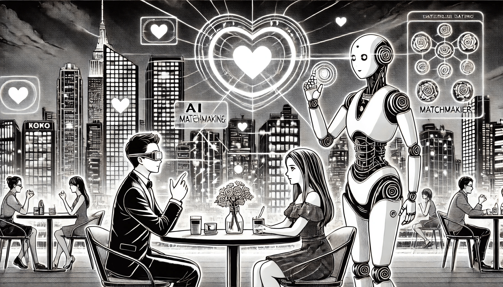

# AI in Dating

### **Revolutionizing Love and Connections**

Imagine a world where love is guided not just by chance or fate but by the precision of algorithms and the power of machine learning. AI is reshaping how people meet, form bonds, and nurture relationships, making the age-old quest for love more personalized, efficient, and inclusive. From advanced matchmaking systems to virtual relationship advisors, AI is transforming modern dating into a blend of science and serendipity. In this chapter, we delve into the transformative impact AI has on the world of romance and its implications for the future of human connections.

<figure><figcaption>
AI in Dating
</figcaption></figure>

### **AI-Powered Matchmaking: Love Meets Data Science**

AI’s role in dating goes far beyond simple compatibility checks. Leading platforms such as **Tinder**, **Bumble**, and **Hinge** leverage AI and machine learning to analyze large datasets, identifying patterns in user behavior that humans might overlook. These systems process everything — from your swiping habits and conversation tendencies to the amount of time you linger on certain profiles.

Instead of merely matching users based on surface-level criteria like hobbies or shared interests, AI can predict deeper compatibility. It assesses emotional cues, communication styles, and long-term relationship goals to create matches that are not just random but meaningful. For instance, machine learning algorithms can predict which users are more likely to have a successful first date or develop a lasting connection based on prior user outcomes.

By constantly learning and adapting, these platforms continuously refine their matchmaking systems, ensuring that love is less about luck and more about calculated compatibility.

### **Enhancing User Experience with Personalization**

AI doesn’t just stop at finding a match; it enriches the entire dating journey. Many apps use AI to recommend the best opening lines, personalized conversation starters, and ideal date ideas based on mutual interests. Some platforms even curate suggestions for virtual or in-person activities, helping users break the ice naturally.

Additionally, AI-powered notifications can prompt users with reminders or tips, such as suggesting the best times to send a message for higher engagement. This level of personalization creates a seamless, user-centric experience where every interaction feels tailored to individual preferences.

### **Virtual Dating Coaches: Boosting Confidence and Connection**

For those navigating the often intimidating world of dating, AI-powered virtual coaches act as supportive guides. These digital assistants analyze profiles, offering insights into how to improve descriptions or photo selections for better results. They can also simulate conversations, helping users practice communication skills and refine their messaging approach.

Using natural language processing and sentiment analysis, virtual coaches provide empathetic feedback, ensuring their advice resonates with users on a human level. Whether it’s helping someone craft a compelling first message or preparing for an in-person meeting, AI becomes a trusted partner in building confidence and fostering authentic connections.

### **The Ethical Dilemma of AI in Dating**

While AI offers incredible opportunities to revolutionize dating, it also presents significant ethical challenges. The effectiveness of AI-driven dating platforms hinges on their ability to collect and process personal data, raising concerns about privacy and consent. Sensitive information — such as sexual orientation, relationship goals, and communication habits — is often stored and analyzed, making these platforms prime targets for data breaches.

There is also the risk of AI manipulation. From fake profiles powered by chatbots to biases embedded in algorithms, the misuse of AI can erode trust and harm user experiences. Ensuring transparency, accountability, and data security is essential for preserving the integrity of AI-driven dating systems.

To address these challenges, developers must prioritize user safety and ethical considerations, implementing robust security measures and clear policies on how data is used.

### **The Future of AI in Dating: Beyond the Swipe**

The evolution of AI in dating is only just beginning. In the near future, we may see immersive virtual dating platforms powered by AI and virtual reality (VR). Imagine going on a "date" to a Parisian café or exploring the Amazon rainforest with a potential match, all from the comfort of your home.

AI could also play a more active role in relationship management, offering guidance to couples on conflict resolution or suggesting activities to strengthen bonds. By analyzing communication patterns, AI could even predict relationship challenges, giving couples the tools to address issues before they escalate.

However, as advanced as these systems become, they will never replace the human element of love. The spontaneity, vulnerability, and raw emotions that define relationships are uniquely human traits that AI can only support, not replicate.

### **Balancing Technology and Humanity**

As AI continues to redefine dating, its success lies in finding harmony between technology and humanity. It can remove some of the barriers to connection, offer meaningful insights, and make love more accessible to people from all walks of life. But at its core, love remains an inherently human experience — one that thrives on authenticity, trust, and emotion.

AI is not here to replace Cupid but to give it a modern upgrade. By blending data-driven precision with emotional intelligence, AI has the potential to revolutionize how we find and foster love, paving the way for deeper, more meaningful connections in an increasingly digital world.
