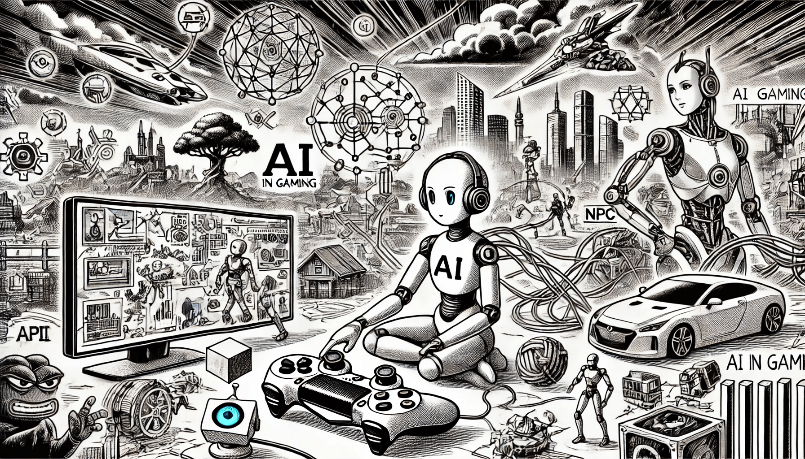

# AI in Gaming

### Transforming Virtual Worlds

The gaming industry has been an early adopter of AI, using it to create smarter non-player characters (NPCs), enhance the gaming experience, and even generate entire game environments autonomously.

<figure><figcaption>
AI in Gaming
</figcaption></figure>

### OpenAI’s Dota 2 Bot

In 2018, OpenAI created an AI system capable of playing the complex multiplayer online battle arena (MOBA) game _Dota 2_ at a high level. The AI, called OpenAI Five, was trained using reinforcement learning, where it played millions of matches against itself to improve its strategy. OpenAI Five defeated professional _Dota 2_ players, showcasing the potential of AI in mastering games that require teamwork, strategy, and adaptability.

### AI-Generated Game Content

AI is also being used to generate game content procedurally. The game _No Man’s Sky_, developed by Hello Games, features an AI system that generates an entire universe with over 18 quintillion planets. Each planet has unique landscapes, ecosystems, and life forms, all created through procedural generation algorithms. This AI-driven approach enables developers to create vast and varied game worlds that would be impossible to design manually.

### Smarter NPCs

In modern games, AI is used to make NPCs behave more realistically. Games like _The Last of Us Part II_ use AI to give enemies more sophisticated behaviors. NPCs can work together to track the player, adapt to different situations, and make more strategic decisions, providing a more immersive gaming experience. AI-driven NPCs help make game worlds feel more dynamic and unpredictable.
