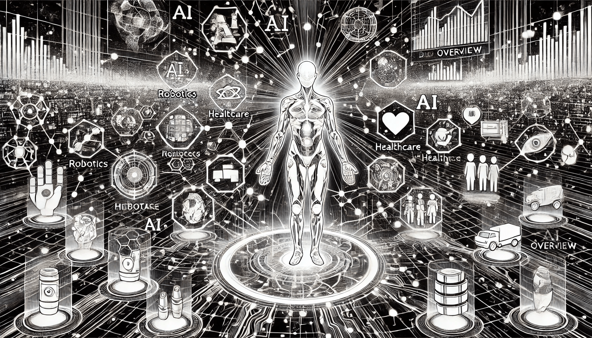

# Overview of AI

### **Prerequisites**

Before diving into AI, it’s essential to have a foundation in basic computing principles. Familiarity with programming languages, data structures, and algorithms is helpful. Additionally, knowledge of mathematics, particularly linear algebra, probability, and statistics, underpins AI's functionality. Understanding machine learning concepts and data processing workflows further prepares one for exploring AI applications.

<figure><figcaption>
Overview of AI
</figcaption></figure>

### What is Artificial Intelligence?

Artificial Intelligence is the field of study that focuses on creating systems capable of intelligent behavior. Some definitions describe it as the study or design of _**intelligent agents**_. An agent in this context can be either software or hardware that interacts with its environment and takes actions to maximize its chances of success.

In a general sense, AI is a branch of computer science that focuses on creating intelligent machines capable of behaving like humans, thinking like humans, and making decisions autonomously. Unlike traditional programming, where every action is predefined, AI-powered systems use algorithms that enable them to learn, reason, and solve problems on their own. This ability to act without pre-programming makes AI a revolutionary tool for various industries, from healthcare to robotics.

By understanding the foundational concepts of AI, we can grasp how machines are evolving to mirror human skills, providing innovative solutions to complex challenges and driving technological advancements across the globe.

### The definition of AI by **Stuart Russell** and **Peter Norvig**

The definition of AI as presented in their seminal book _Artificial Intelligence: A Modern Approach_, is framed around different perspectives of AI:

1. **Thinking Humanly**: AI is about building systems that simulate human thought processes.
2. **Acting Humanly**: AI involves creating machines that perform tasks in ways that mimic human behavior.
3. **Thinking Rationally**: AI is focused on designing systems that use logical reasoning to solve problems.
4. **Acting Rationally**: AI involves constructing agents that act to achieve the best outcome or maximize goal achievement based on available knowledge.

In essence, Russell and Norvig define AI as the study of intelligent agents — systems that perceive their environment and take actions to maximize their chances of successfully achieving their objectives. This broad definition encompasses both human-like intelligence and rationality-driven decision-making.

### **Why Do We Need AI?**

AI addresses challenges that traditional computing cannot. From automating repetitive tasks to making predictions from vast datasets, AI fills gaps where human labor and conventional software fall short. For example, it enables fraud detection in real-time, personalized recommendations in e-commerce, and advanced medical diagnostics. In an increasingly data-driven world, AI empowers decision-making at an unprecedented scale and speed.

### **Why AI Matters?**

AI matters because it enables progress. It’s not just about automation but about amplifying human potential. AI models can analyze patterns in data far faster than humans, uncovering insights that were previously inaccessible. Moreover, its ability to learn and improve makes it adaptive, ensuring it remains relevant as problems evolve. This transformative capability has implications across sectors, from healthcare to finance, education, and beyond.

### **Key Benefits of AI**

1. **Efficiency and Automation**: AI automates mundane tasks, saving time and reducing errors.
2. **Enhanced Decision-Making**: It provides data-driven insights for more informed decisions.
3. **Scalability**: AI can process vast amounts of data and scale solutions efficiently.
4. **Personalization**: AI tailors experiences, such as curated content or customer service.
5. **Innovation Catalyst**: It drives technological advancements, fostering creativity and discovery.
