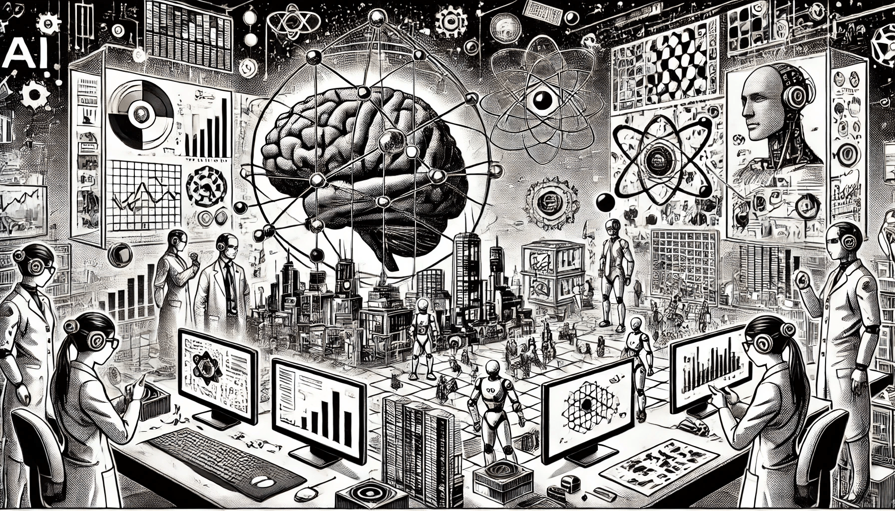

# Theoretical Foundations of AI

Artificial Intelligence (AI) is transforming the world, but its power comes from deep theoretical foundations. Understanding these principles is essential for developing intelligent systems that can reason, learn, and adapt.

<figure><figcaption>
Theoretical Foundations of AI
</figcaption></figure>

This section explores key concepts that shape AI. It begins with **problem-solving techniques**, covering algorithms and heuristics that help machines make decisions. Next, it delves into **knowledge representation and uncertainty**, explaining how AI systems manage incomplete or ambiguous information. **Cybernetics**, the study of feedback and control in machines, provides insights into AI’s interaction with dynamic environments. Finally, the **philosophical and ethical aspects** of AI address critical questions about intelligence, consciousness, and responsible AI development.

By understanding these theoretical foundations, we gain a clearer vision of AI’s capabilities and limitations, paving the way for more advanced and ethical AI applications.
