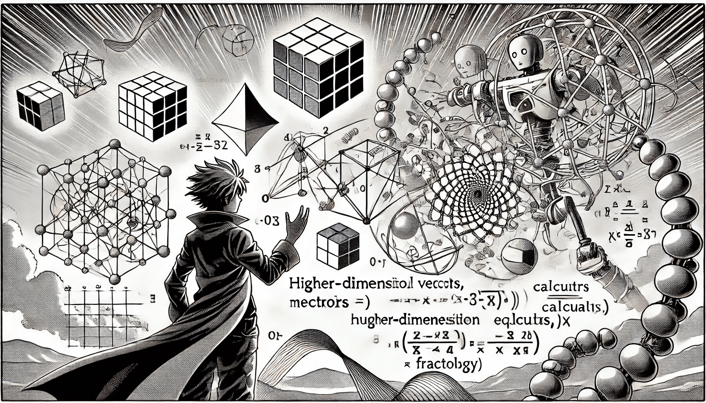

# Advanced Topics

<figure><figcaption>
Advanced Topics
</figcaption></figure>

• Convex Optimization

• Definition and importance in machine learning

• Support Vector Machines

• Understanding the role of hyperplanes and margins

• Neural Networks

• Basics of neural network architecture and backpropagation
