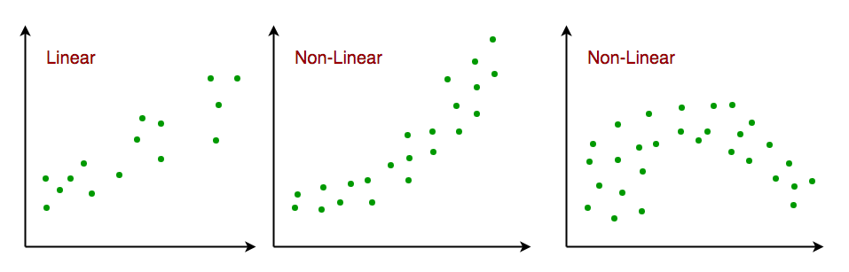
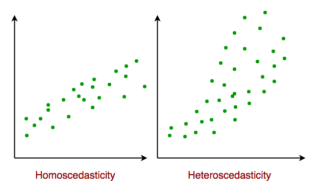

# Assumptions of Linear Regression

Assumptions of Simple Linear Regression

#### **Assumptions of Linear Regression**

####

Linear regression relies on several key assumptions for optimal performance:

1. **Linearity**: The relationship between independent and dependent variables is linear.
2. **Independence**: Observations are independent of each other.
3. **Homoscedasticity**: The variance of residual errors is constant across all levels of the independent variables.
4. **Normality**: Residuals (errors) are normally distributed.
5. **No Multicollinearity** (in multiple linear regression): Independent variables should not be highly correlated with each other.

Violating these assumptions can lead to inaccurate predictions, so it’s essential to check them before finalizing a model.

### Assumptions of Simple Linear Regression 

Linear regression is a powerful tool for understanding and predicting the behavior of a variable, however, it needs to meet a few conditions in order to be accurate and dependable solutions.

1.  **Linearity**: The independent and dependent variables have a linear relationship with one another. This implies that changes in the dependent variable follow those in the independent variable(s) in a linear fashion. This means that there should be a straight line that can be drawn through the data points. If the relationship is not linear, then linear regression will not be an accurate model.\\

    <figure><figcaption></figcaption></figure>
2. **Independence**: The observations in the dataset are independent of each other. This means that the value of the dependent variable for one observation does not depend on the value of the dependent variable for another observation. If the observations are not independent, then linear regression will not be an accurate model.
3.  **Homoscedasticity**: Across all levels of the independent variable(s), the variance of the errors is constant. This indicates that the amount of the independent variable(s) has no impact on the variance of the errors. If the variance of the residuals is not constant, then linear regression will not be an accurate model.\\

    Homoscedasticity in Linear Regression\\

    
<figure><figcaption></figcaption></figure>

4. **Normality**: The residuals should be normally distributed. This means that the residuals should follow a bell-shaped curve. If the residuals are not normally distributed, then linear regression will not be an accurate model.

### Assumptions of Multiple Linear Regression 

For Multiple Linear Regression, all four of the assumptions from Simple Linear Regression apply. In addition to this, below are few more:

1. **No multicollinearity**: There is no high correlation between the independent variables. This indicates that there is little or no correlation between the independent variables. Multicollinearity occurs when two or more independent variables are highly correlated with each other, which can make it difficult to determine the individual effect of each variable on the dependent variable. If there is multicollinearity, then multiple linear regression will not be an accurate model.
2. **Additivity:** The model assumes that the effect of changes in a predictor variable on the response variable is consistent regardless of the values of the other variables. This assumption implies that there is no interaction between variables in their effects on the dependent variable.
3. **Feature Selection:** In multiple linear regression, it is essential to carefully select the independent variables that will be included in the model. Including irrelevant or redundant variables may lead to overfitting and complicate the interpretation of the model.
4. **Overfitting:** Overfitting occurs when the model fits the training data too closely, capturing noise or random fluctuations that do not represent the true underlying relationship between variables. This can lead to poor generalization performance on new, unseen data.

#### **Multicollinearity**

Multicollinearity is a statistical phenomenon that occurs when two or more independent variables in a multiple regression model are highly correlated, making it difficult to assess the individual effects of each variable on the dependent variable.

**Detecting Multicollinearity includes two techniques:**

* **Correlation Matrix:** Examining the correlation matrix among the independent variables is a common way to detect multicollinearity. High correlations (close to 1 or -1) indicate potential multicollinearity.
* **VIF (Variance Inflation Factor):** VIF is a measure that quantifies how much the variance of an estimated regression coefficient increases if your predictors are correlated. A high VIF (typically above 10) suggests multicollinearity.
