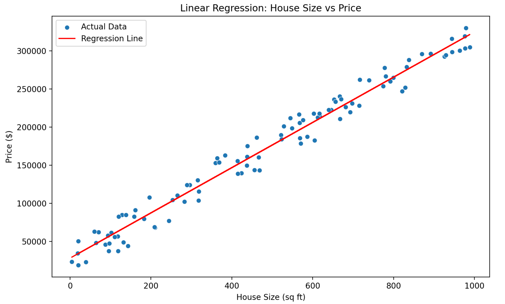
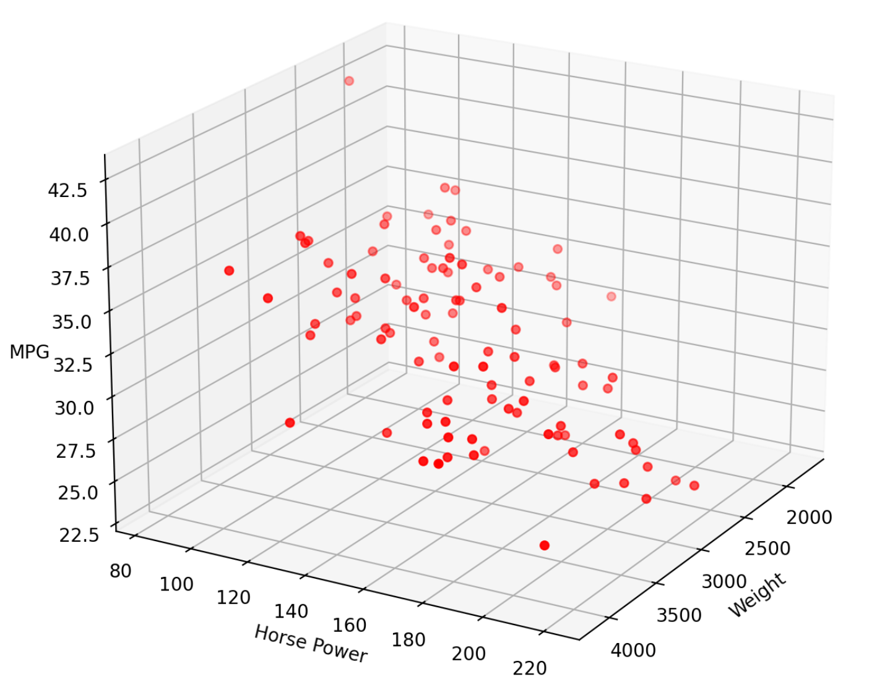
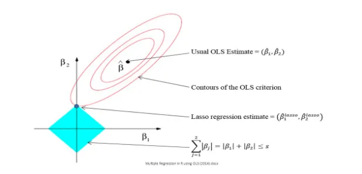
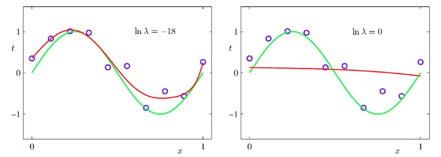

# Types of Linear Regression

There are two main types of linear regression and two additional types, Let's take a look at them.

### **1. Simple Linear Regression**

Used when there is only one independent variable. For example, predicting a person’s based on their height.

This is the simplest form of linear regression, and it involves only one independent variable and one dependent variable. The equation for simple linear regression is: $$y=\beta_{0} ​ +\beta _{1} ​* x$$

where:

* $$y$$ is the dependent variable
* $$x$$ is the independent variable
* $$β_0$$ is the intercept
* $$β_1$$ is the slope

**Example:**

Predicting house price based on house size.

<figure><figcaption></figcaption></figure>

### **2. Multiple Linear Regression**

Involves two or more independent variables, such as predicting house prices based on factors like area, number of rooms, and location.

This involves more than one independent variable and one dependent variable. The equation for multiple linear regression is: $$y = \beta_0 + \beta_1 x_1 + \beta_2 x_2 + \dots + \beta_n x_n$$

where:

* $$y$$ is the dependent variable
* $$x1, x2, …, xn$$ are the independent variables
* $$β_0$$ is the intercept
* $$β_1, β_2, …, β_n$$ are the slopes

**Example:**

Predicting motor MPG (Miles Per Gallon) based on horse power and weight.

<figure><figcaption>
Multiple Linear Regression
</figcaption></figure>

### **3. Regularized Linear Regression**

Techniques like **Lasso** (Least Absolute Shrinkage and Selection Operator) and **Ridge Regression** add penalties to the model for higher coefficients, reducing overfitting and improving model generalization.

Regularization introduces a penalty term to the linear regression cost function, helping prevent overfitting by constraining large coefficients.

#### 1. Lasso Regression (Least Absolute Shrinkage and Selection Operator)

In Lasso regression, the penalty added is proportional to the absolute value of each coefficient. The cost function to minimize is:

$$J(\beta) = \sum_{i=1}^{n} (y_i - \hat{y_i})^2 + \lambda \sum_{j=1}^{p} |\beta_j|$$\
\
where:

• $$J(\beta)$$ is the cost function,

• $$y_i$$ is the actual value,

• $$\hat{y_i}$$ is the predicted value,

• $$\lambda$$ is the regularization parameter controlling the penalty’s strength,

• $$\beta_j$$ represents the coefficients of each feature.

The L1 -norm penalty $$\sum_{j=1}^{p} |\beta_j|$$ often results in some coefficients being reduced to zero, effectively performing feature selection.

<figure><figcaption></figcaption></figure>

#### 2. Ridge Regression

Ridge regression uses an L2 -norm penalty, where the sum of the squared coefficients is added to the cost function:

$$J(\beta) = \sum_{i=1}^{n} (y_i - \hat{y_i})^2 + \lambda \sum_{j=1}^{p} \beta_j^2$$\
\
Here:

• $$\sum_{j=1}^{p} \beta_j^2$$ is the L2 -norm, which penalizes large coefficients more smoothly than Lasso.

This penalty tends to reduce the impact of all coefficients but doesn’t force any to zero, making Ridge regression useful when all features are considered potentially valuable.

<figure><figcaption></figcaption></figure>

These formulas are essential for understanding how polynomial and regularized linear regressions adjust the model’s complexity and enhance its ability to generalize across diverse datasets.
