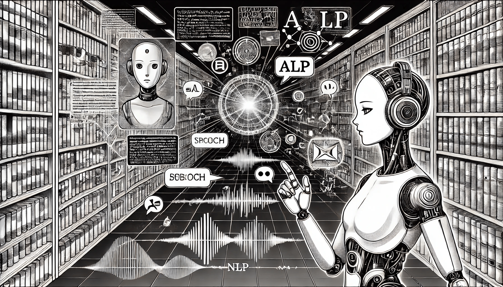

# Overview of NLP

### What is Natural Language Processing?

Natural Language Processing (NLP) is a field of artificial intelligence that focuses on enabling computers to understand, interpret, and generate human language. By bridging the gap between human communication and machine understanding, NLP facilitates seamless interaction between people and technology. Unlike traditional programming where commands are rigidly structured, NLP allows systems to process unstructured data, such as text and speech, and derive meaningful insights from it.

<figure><figcaption>
Overview of NLP
</figcaption></figure>

NLP matters because language is the primary mode of human communication. From casual conversations to academic research, the ability to process language is vital for enabling machines to assist, augment, and automate human tasks. Without NLP, tasks like searching for information, translating languages, or even interacting with voice assistants would be impossible.

### Importance of NLP in Modern Applications

In today’s digital world, NLP plays a pivotal role in a wide array of modern applications. As the volume of data grows exponentially, the demand for systems capable of processing this information in real-time becomes critical. NLP ensures that organizations can leverage this data effectively, converting raw text into actionable insights. Here are some key reasons why NLP is essential:

1. **Improved Accessibility:** NLP-powered systems like text-to-speech (TTS) and speech-to-text (STT) make digital tools accessible to individuals with disabilities.
2. **Enhanced User Experience:** Applications like virtual assistants (e.g., Siri, Alexa) and chatbots rely on NLP to provide intuitive, human-like interactions.
3. **Automation of Routine Tasks:** NLP automates tasks such as data entry, document classification, and summarization, saving time and reducing errors.
4. **Facilitating Global Communication:** NLP powers translation tools like Google Translate, enabling seamless communication across language barriers.

### Applications of NLP Across Industries

NLP has transformed numerous industries by automating processes, improving efficiency, and uncovering new possibilities. Below are some notable applications:

#### **1. Healthcare**

* **Medical Record Analysis:** Extracting insights from electronic health records to improve patient care.
* **Symptom Checkers:** Chatbots that use NLP to interpret symptoms and suggest potential conditions.
* **Clinical Research:** Summarizing vast volumes of medical literature to aid in drug development.

#### **2. Finance**

* **Fraud Detection:** Analyzing textual data from transactions and emails to identify fraudulent activities.
* **Sentiment Analysis:** Gauging market sentiment from news articles, social media, and analyst reports.
* **Customer Support:** NLP-driven chatbots provide real-time assistance for banking queries.

#### **3. E-commerce**

* **Product Recommendations:** Analyzing customer reviews and preferences to personalize recommendations.
* **Search Optimization:** Enabling users to find products through natural language queries.
* **Review Summarization:** Generating concise summaries of user feedback to assist potential buyers.

#### **4. Education**

* **Language Learning Applications:** Tools like Duolingo use NLP to teach new languages effectively.
* **Automated Essay Scoring:** Assessing the quality of written work and providing feedback.
* **Content Personalization:** Adapting learning materials to suit individual student needs.

#### **5. Marketing and Advertising**

* **Social Media Monitoring:** Analyzing trends and customer opinions to guide campaigns.
* **Ad Targeting:** Understanding customer intent through NLP to serve relevant advertisements.
* **Content Generation:** Tools like GPT-based systems assist in writing ad copy and blogs.

### Future Trends in NLP

The future of NLP is exciting, with advancements in deep learning and pre-trained language models leading the way. Some emerging trends include:

1. **Transformer Models:** Innovations like GPT and BERT are improving language understanding and generation capabilities.
2. **Multimodal NLP:** Combining text, images, and audio for richer interaction (e.g., generating captions for videos).
3. **Low-Resource Language Processing:** Developing tools for underrepresented languages to ensure inclusivity.
4. **Ethical NLP:** Creating systems that are unbiased, transparent, and privacy-focused.

### Conclusion

Natural Language Processing is a cornerstone of modern artificial intelligence, driving innovation across industries and enhancing human-computer interaction. From healthcare to education, NLP enables machines to interpret and generate language, opening new avenues for automation and accessibility. As NLP continues to evolve, its potential to transform our daily lives becomes increasingly evident.
