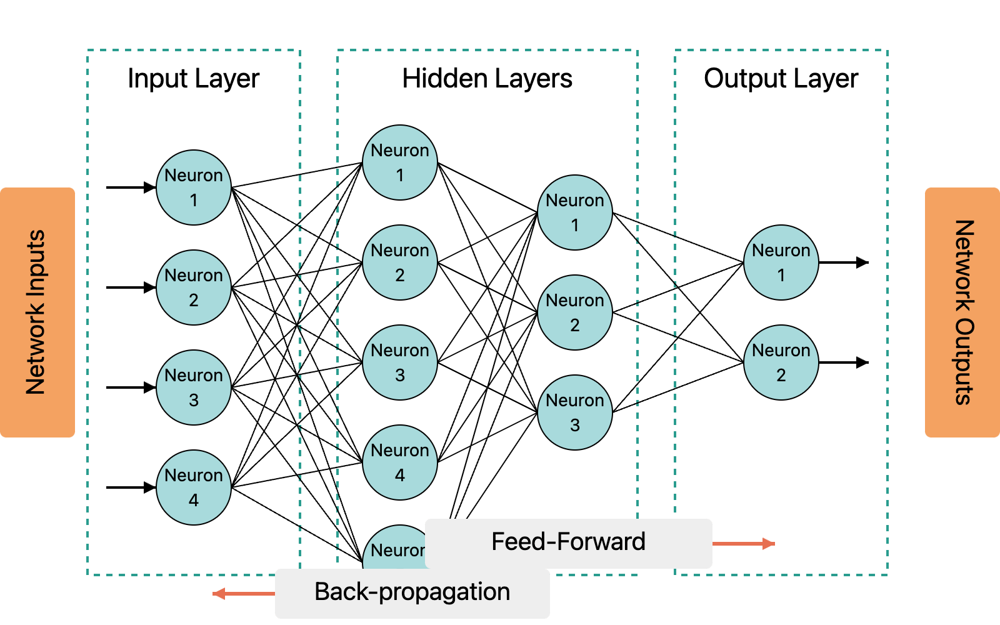

# Connections and Weights

### Connections Between Neurons

Neurons are interconnected, with each connection represented by a weight. These connections determine how information flows through the network.

* **Forward Propagation**:\
  During forward propagation, inputs are passed through the network layer by layer, with each connection applying its weight to the input data.
* **Backpropagation**:\
  During training, errors are propagated backward through the network, and weights are updated to minimize the error using techniques like gradient descent.

<figure><figcaption></figcaption></figure>

### Weights: The Learnable Parameters

Weights are the core learnable components of a neural network. They determine the influence of one neuron on another. Initially, weights are set randomly or using specialized initialization techniques, such as **Xavier** or **He** initialization. Through training, these weights are adjusted to optimize the network’s performance.

#### Xavier and He Initialization

The initialization of weights in a neural network plays a crucial role in training, as improper initialization can lead to convergence issues, vanishing gradients, or exploding gradients.

**1. Xavier (Glorot) Initialization**

Proposed by Glorot and Bengio, Xavier initialization is used for networks with _sigmoid_ or _tanh_ activation functions. The idea is to keep the weights from being too large or too small, helping to prevent gradient vanishing or explosion. The weights are initialized using the following formula:

$$W \sim U\left(-\frac{\sqrt{6}}{\sqrt{n_{\text{in}} + n_{\text{out}}}}, \frac{\sqrt{6}}{\sqrt{n_{\text{in}} + n_{\text{out}}}}\right)$$

where is the number of input neurons and $$n_{\text{out}}$$ is the number of output neurons.

**2. He Initialization**

Developed by Kaiming He and colleagues, He initialization is better suited for _ReLU_ and _Leaky ReLU_ activations. It accounts for the fact that ReLU zeroes out some values and uses a slightly larger variance:

$$W \sim \mathcal{N}\left(0, \frac{2}{n_{\text{in}}}\right)$$\\

This helps maintain stable gradient propagation even in deep networks.

### Bias: Adjusting the Decision Boundary

Biases are additional parameters that help shift the activation function, improving the network’s flexibility to fit data patterns.

Without bias, a neuron could only model functions that pass through the origin (i.e., it would not be able to account for cases where the output should be nonzero when all inputs are zero).

Example: Suppose we have a simple linear function without bias:

$$y = w \cdot x$$

If $$x = 0$$ , then $$y$$ will always be $$0$$, regardless of the weight $$w$$ . This limits the model’s flexibility. By adding bias $$b$$ , the formula becomes:

$$y = w \cdot x + b$$

Now, the neuron can shift its decision boundary, making the model more powerful and capable of better fitting data patterns.
