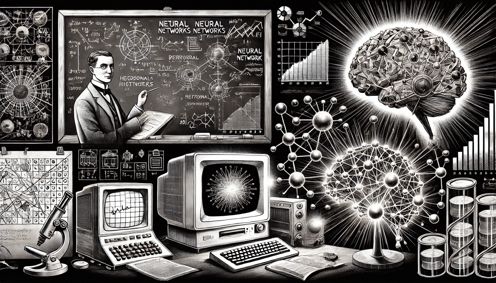

# History of NN

### The History of Neural Networks

The development of neural networks has been a fascinating journey of breakthroughs, challenges, and resurgences. From early theoretical models to the deep learning systems of today, this chapter explores the milestones that have shaped neural networks into a transformative technology.

<figure><figcaption>
History of NN
</figcaption></figure>

### **1940s-1950s: Early Concepts**

The idea of neural networks began with **Warren McCulloch** and **Walter Pitts**, who introduced the first mathematical model of artificial neurons in 1943. Their work laid the groundwork for understanding how networks of simple units could perform logical operations. However, limited computational power made it difficult to turn these theories into practical systems.

### **1960s-1970s: Perceptrons**

In the late 1950s, **Frank Rosenblatt** developed the perceptron, a simple neural network model designed to recognize patterns. It was an exciting step forward, as it could solve problems that were linearly separable. However, **Marvin Minsky** and **Seymour Papert** highlighted its limitations in their 1969 book _Perceptrons_, showing that single-layer networks couldn’t handle more complex problems. This critique temporarily slowed progress.

### **1980s: Backpropagation and Connectionism**

The 1980s marked a turning point with the introduction of backpropagation, a method for training multi-layer networks, by **David Rumelhart**, **Geoffrey Hinton**, and **Ronald Williams**. Backpropagation enabled neural networks to learn from errors, making them much more effective. During this era, "connectionism" emerged, emphasizing networks of interconnected nodes that could mimic cognitive processes.

### **1990s: Boom and Winter**

The 1990s saw a surge in neural network applications, from image recognition to finance. However, as expectations outpaced results and computational costs remained high, neural network research entered a "winter." Interest waned as researchers explored other machine learning methods.

### **2000s: Resurgence and Deep Learning**

Advances in computational power, the availability of larger datasets, and the creation of new architectures brought neural networks back into the spotlight. Researchers began developing deep learning techniques, using networks with many layers to achieve unprecedented accuracy in tasks like speech and image recognition.

### **2010s: Deep Learning Dominance**

The 2010s marked the age of deep learning dominance. Architectures like convolutional neural networks (CNNs) and recurrent neural networks (RNNs) excelled in areas like image recognition, natural language processing, and even complex gaming environments. Innovations like **Google DeepMind’s AlphaGo** showcased neural networks' ability to achieve superhuman performance in games like Go. Today, neural networks are the backbone of countless AI applications, from virtual assistants to autonomous vehicles.

### **2020s: The Age of Scale and Democratization**

The 2020s have been characterized by a focus on scalability, accessibility, and increasingly versatile applications of neural networks.

1. **Scaling Up Neural Networks**:
   * Models like **OpenAI’s GPT-3** (2020) pushed the boundaries of what neural networks can do, with 175 billion parameters, enabling coherent and human-like text generation across diverse tasks.
   * Other large-scale models, such as **Google’s PaLM** (Pathways Language Model) and **OpenAI’s CLIP**, showcased the growing trend of using massive datasets and computation to build general-purpose AI systems.
2. **Advances in Efficiency**:
   * Researchers developed methods like knowledge distillation and pruning to make neural networks more efficient, reducing their energy and hardware requirements. This made deep learning models more accessible for deployment on edge devices like smartphones and IoT devices.
3. **Ethical and Social Implications**:
   * As neural networks became widely used, concerns about bias, transparency, and ethical AI grew. This sparked the development of fairness and explainability tools, aiming to address these issues while ensuring AI models align with societal values.
4. **Key Innovations in 2020s Applications**:
   * **Healthcare**: Neural networks have been pivotal in detecting diseases, predicting patient outcomes, and accelerating drug discovery, as seen with COVID-19 vaccines.
   * **Generative AI**: Neural networks underpin models like **DALL-E** and **Stable Diffusion**, enabling the creation of realistic images, music, and videos from simple text prompts.
   * **Autonomous Systems**: Self-driving cars and robots saw major advances through neural networks capable of processing real-time sensor data, mapping environments, and making split-second decisions.
   * **Climate Science**: Neural networks were employed to analyze climate patterns, predict extreme weather events, and optimize renewable energy systems.
5. **AI Everywhere**:
   * The integration of AI into consumer products has become seamless. Virtual assistants (like **Siri** and **Alexa**), recommendation systems, and chatbots rely heavily on neural networks for personalized and context-aware responses.

### **Looking Ahead**

The history of neural networks demonstrates a cycle of innovation, setbacks, and breakthroughs. As hardware improves and new algorithms are developed, neural networks are expected to play an even bigger role in fields like healthcare, climate science, and robotics.

Neural networks’ story is far from over — it’s an ever-evolving field with limitless potential.
