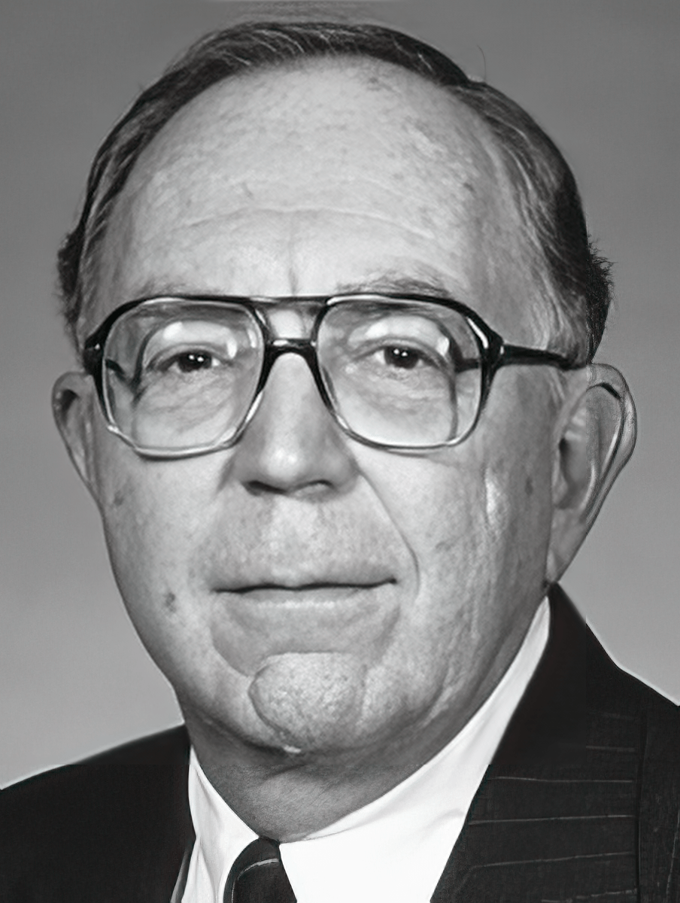
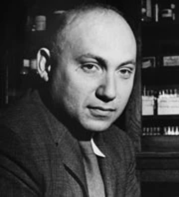
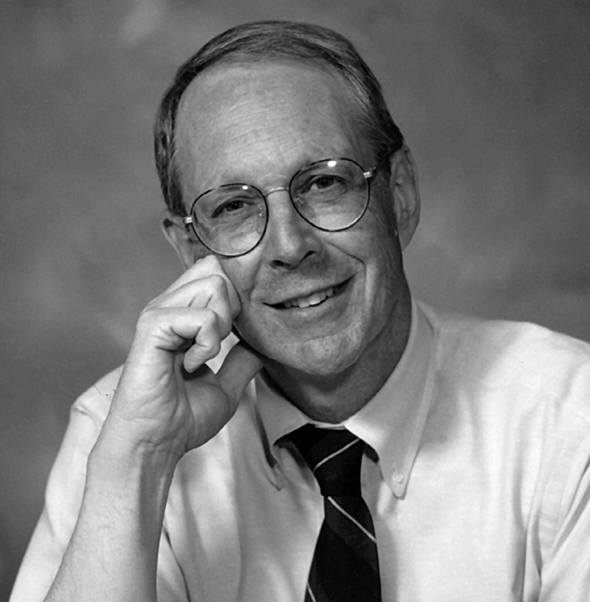
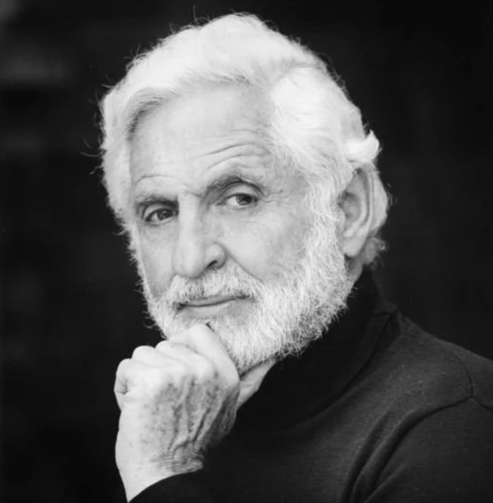

# Origins and Early ES

### Origins and Early ES

ES are an important type of artificial intelligence (AI). Their goal is to copy human experts' thinking and decision-making skills in specific areas. They use knowledge, rules, and logical thinking to solve difficult problems that usually need human experts.

### Historical Context

The idea of ES started to become popular in the 1960s and 1970s. During this period, AI researchers wanted to create practical applications that showed clear value. They aimed to put human expert knowledge into computers, allowing computers to imitate human problem-solving and decision-making abilities.

### Key Contributors and Early Innovations

Early contributors to ES developed methods to copy human expertise in computers. They created ways for computers to reason and make decisions similar to human experts. Their work laid the foundation for systems using logical rules and structured knowledge to solve complex problems.

**1. Edward Feigenbaum**

<figure><figcaption>
<strong>Edward Feigenbaum</strong>
</figcaption></figure>

Edward Feigenbaum is one of the main early figures in Expert Systems. He is often called the "father of expert systems." \
\
In 1965, he worked with **Joshua Lederberg**, **Bruce Buchanan**, and **Carl Djerassi** at Stanford University.&#x20;

**2. Joshua Lederberg**

<figure><figcaption>
Joshua Lederberg
</figcaption></figure>

Joshua Lederberg was an American molecular biologist known for his work in microbial genetics, artificial intelligence, and the United States space program. He was 33 years old when he won the 1958 Nobel Prize in Physiology or Medicine for discovering that bacteria can mate and exchange genes

**3. Bruce Buchanan**

<figure><figcaption>
Bruce Buchanan
</figcaption></figure>

University Professor of Computer Science Emeritus, University of Pittsburgh, he received a B.A. degree in Mathematics from Ohio Wesleyan University (1961), and his M.S. and Ph.D. degrees in Philosophy from Michigan State University (1966). He was on the faculty at Stanford University and the University of Pittsburgh, with appointments in computer science, philosophy, medicine, and intelligent systems. He is known for his work in artificial intelligence, the development of the Stanford Artificial Intelligence Laboratory and the artificial intelligence (AI) community.

**4. Carl Djerassi**

<figure><figcaption>
Carl Djerassi
</figcaption></figure>

Carl Djerassi was an Austrian-American chemist famous for helping develop the first oral contraceptive pill. He made significant contributions to chemistry and later became known as an author and playwright. Djerassi also played an important role in early research on expert systems, collaborating on pioneering AI projects.

They worked together to create a system that could think like expert chemists. Their project laid important foundations by structuring specialized knowledge using logical rules and reasoning.

### Notable Early Expert Systems

#### **DENDRAL (1965)**

Developed in 1965 at Stanford University, DENDRAL was among the first expert systems designed to assist chemists in identifying chemical compounds. It used a rule-based inference engine and domain-specific heuristics to analyze mass spectrometry data and generate hypotheses about molecular structures. DENDRAL’s success established Expert Systems' practical value and demonstrated their potential to support scientific discovery.

#### **MYCIN (1972–1976)**

In development from 1972 to 1976, MYCIN was created to diagnose bacterial infections and suggest antibiotic treatments. Also originating from Stanford University, MYCIN utilized a knowledge base of over 450 rules and an inference engine using backward chaining to derive diagnoses. It introduced the use of certainty factors to manage uncertainty in medical reasoning — an innovation ahead of its time. Despite never being used clinically due to legal and ethical concerns, MYCIN became a landmark project in AI.

#### **PROSPECTOR (1978)**

Developed starting in 1978 by SRI International, PROSPECTOR was an Expert System designed for geological exploration. It employed probabilistic reasoning to evaluate mineral data and became famous in the early 1980s after successfully identifying a valuable molybdenum deposit in Washington State. It combined rules with Bayesian updating, a technical approach that made it suitable for handling uncertain geological data.

#### **XCON (1979)**

XCON, originally known as R1, was developed in 1979 by John P. McDermott at Digital Equipment Corporation (DEC). It automated the configuration of VAX computer systems, reducing errors and saving DEC millions of dollars. XCON utilized a forward-chaining rule engine and had a knowledge base of thousands of rules at its peak. It was among the first large-scale industrial Expert Systems to be deployed in a commercial environment.

### Technological Approaches and Innovations

Early Expert Systems relied primarily on rule-based systems, structured around clearly defined inference rules and knowledge bases. These rules were written in the form of IF-THEN statements. The systems typically included:

* **Knowledge Base**: Stores facts and heuristics.
* **Inference Engine**: Applies logical rules to the knowledge base to derive conclusions. Engines used techniques like:
  * **Forward chaining** (data-driven reasoning): starts with known facts and applies rules to extract more data until a goal is reached.
  * **Backward chaining** (goal-driven reasoning): starts with a goal and works backward to determine what data supports that goal.
* **Explanation Facility**: Explains the system's reasoning process.

### Global Contributions

Although much early pioneering work emerged from the United States, global contributions were significant. In the UK, the University of Edinburgh and Imperial College London produced important theoretical work on knowledge representation and AI reasoning. Japan's Ministry of International Trade and Industry launched the Fifth Generation Computer Systems project in 1982, aiming to advance AI and logic programming, including Expert Systems development using Prolog-based platforms. These initiatives inspired further research across Europe and Asia.

### Impact and Challenges

Despite initial successes, early Expert Systems faced numerous limitations. They required extensive manual input of domain knowledge, which was resource-intensive. Maintenance and updates posed significant challenges, as knowledge bases quickly became outdated. Systems also lacked learning capabilities, making them rigid in adapting to new knowledge. Nevertheless, these early limitations stimulated further research, driving the development of more flexible and adaptive AI technologies, including machine learning and neural networks.

### Legacy and Influence

Early Expert Systems significantly shaped future AI research directions. They established foundational principles in knowledge representation, inference engines, and decision support that are still used in modern AI. The architecture and design of these systems influenced the development of intelligent agents, diagnostic systems, and modern applications in fields such as healthcare, engineering, and finance. The legacy of DENDRAL, MYCIN, PROSPECTOR and XCON lives on as milestones in the evolution of applied artificial intelligence.
