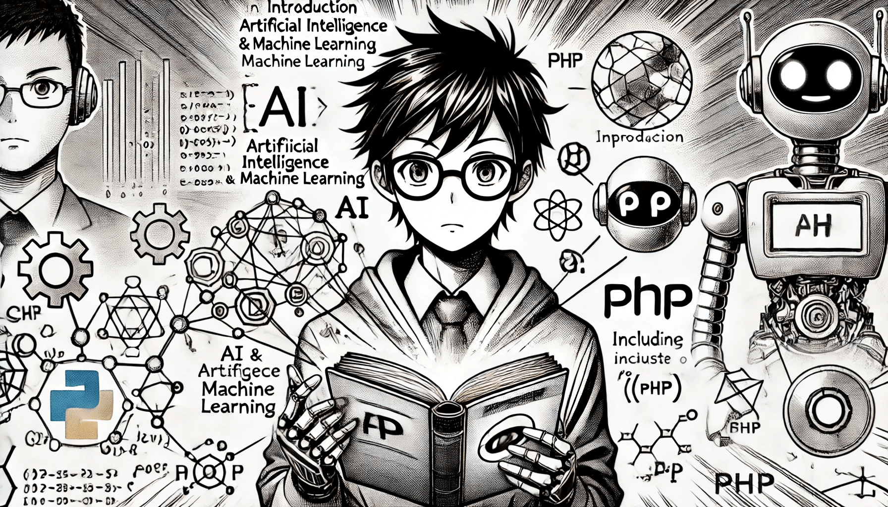

# Introduction

<figure><figcaption></figcaption></figure>

The goal of this book is to explain the basics of artificial intelligence and machine learning in a way that is easy to understand. All formulas, ideas, and code examples will be shown using PHP, so you can learn and apply the concepts explained step by step.

### Why AI with PHP?

PHP has been a leader in web development for decades, but its potential for AI remains unexplored. We will try to put PHP at the center of our training, giving you the opportunity to explore how this powerful language can be used to build intelligent systems.
