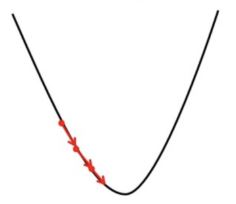

# Gradient Descent

## Gradient Descent in Linear Regression

We know that in any machine learning project our main aim relies on how good our project accuracy is or how much our model prediction differs from the actual data point. Based on the difference between model prediction and actual data points we try to find the parameters of the model which give better accuracy on our dataset\\, In order to find these parameters we apply gradient descent on the cost function of the machine learning model.

### What is Gradient Descent

Gradient Descent is an iterative optimization algorithm that tries to find the optimum value (Minimum/Maximum) of an objective function. It is one of the most used optimization techniques in machine learning projects for updating the parameters of a model in order to minimize a cost function.

The main aim of gradient descent is to find the best parameters of a model which gives the highest accuracy on training as well as testing datasets. In gradient descent, The gradient is a vector that points in the direction of the steepest increase of the function at a specific point. Moving in the opposite direction of the gradient allows the algorithm to gradually descend towards lower values of the function, and eventually reaching to the minimum of the function.

#### Steps Required in Gradient Descent Algorithm

* **Step 1** we first initialize the parameters of the model randomly
* **Step 2** Compute the gradient of the cost function with respect to each parameter. It involves making partial differentiation of cost function with respect to the parameters.
* **Step 3** Update the parameters of the model by taking steps in the opposite direction of the model. Here we choose a hyperparameter learning rate which is denoted by alpha. It helps in deciding the step size of the gradient.
* **Step 4** Repeat steps 2 and 3 iteratively to get the best parameter for the defined model

#### Pseudocode for Gradient Descent

```
t ← 0
max_iterations ← 1000
w, b ← initialize randomly

while t < max_iterations do
    t ← t + 1
    w_t+1 ← w_t − η ∇w_t
    b_t+1 ← b_t − η ∇b_t
end
```

> Here max\_iterations is the number of iteration we want to do to update our parameter
>
> W,b are the weights and bias parameter
>
> η is the learning parameter also denoted by alpha

To apply this gradient descent on data using any programming language we have to make four new functions using which we can update our parameter and apply it to data to make a prediction. We will see each function one by one and understand it

1. **gradient\_descent –** In the gradient descent function we will make the prediction on a dataset and compute the difference between the predicted and actual target value and accordingly we will update the parameter and hence it will return the updated parameter.
2. **compute\_predictions –** In this function, we will compute the prediction using the parameters at each iteration.
3. **compute\_gradient –** In this function we will compute the error which is the difference between the actual and predicted target value and then compute the gradient using this error and training data.
4. **update\_parameters –** In this separate function we will update the parameter using learning rate and gradient that we got from the compute\_gradient function.

```
function gradient_descent(X, y, learning_rate, num_iterations):
    Initialize parameters  = θ
    for iter in range(num_iterations):
        predictions = compute_predictions(X, θ)
        gradient = compute_gradient(X, y, predictions)
        update_parameters(θ, gradient, learning_rate)
    return θ

function compute_predictions(X, θ):
    return X*θ

function compute_gradient(X, y, predictions):
    error = predictions - y
    gradient = Xᵀ * error / m
    return gradient

function update_parameters(θ, gradient, learning_rate):
    θ = θ - learning_rate ⨉ gradient
```

### Mathematics Behind Gradient Descent

In the Machine Learning Regression problem, our model targets to get the best-fit regression line to predict the value y based on the given input value (x). While training the model, the model calculates the cost function like Root Mean Squared error between the predicted value (pred) and true value (y). Our model targets to minimize this cost function.\
To minimize this cost function, the model needs to have the best value of θ1 and θ2(for Univariate linear regression problem). Initially model selects θ1 and θ2 values randomly and then iteratively update these value in order to minimize the cost function until it reaches the minimum. By the time model achieves the minimum cost function, it will have the best θ1 and θ2 values. Using these updated values of θ1 and θ2 in the hypothesis equation of linear equation, our model will predict the output value y.

#### **How do θ1 and θ2 values get updated?**

**Linear Regression Cost Function:** J(θ)=12m∑i=1m(hθ(x(i))–y(i))2J(θ)=2m1​∑i=1m​(hθ​(x(i))–y(i))2

so our model aim is to Minimize \frac{1}{2m} \sum\_{i=1}^{m} (h\_\theta(x^{(i)}) – y^{(i)})^2 and store the parameters which makes it minimum.

#### **Gradient Descent Algorithm For Linear Regression**

**Cost Function**

$$J(\Theta_0, \Theta_1) = \frac{1}{2m} \sum_{i=1}^{m} \left[ h_\Theta(x_i) - y_i \right]^2$$

• True Value: $$y_i$$

• Predicted Value: $$h_\Theta(x_i)$$

**Gradient Descent**

$$\Theta_j = \Theta_j - \alpha \frac{\partial}{\partial \Theta_j} J(\Theta_0, \Theta_1)$$

• Learning Rate: $$\alpha$$

**Now:**\
$$\frac{\partial}{\partial \Theta_j} J_\Theta = \frac{\partial}{\partial \Theta_j} \frac{1}{2m} \sum_{i=1}^{m} \left[ h_\Theta(x_i) - y \right]^2$$

$$= \frac{1}{m} \sum_{i=1}^{m} \left( h_\Theta(x_i) - y \right) \frac{\partial}{\partial \Theta_j} (\Theta x_i - y)$$

$$= \frac{1}{m} \sum_{i=1}^{m} \left( h_\Theta(x_i) - y \right) x_i$$

**Therefore**: $$\Theta_j := \Theta_j - \frac{\alpha}{m} \sum_{i=1}^{m} \left( h_\Theta(x_i) - y \right) x_i$$

Gradient descent algorithm for linear regression

<pre><code><strong>-> θj     : Weights of the hypothesis.
</strong><strong>-> hθ(xi) : predicted y value for ith input.
</strong><strong>-> i     : Feature index number (can be 0, 1, 2, ......, n).
</strong><strong>-> α     : Learning Rate of Gradient Descent.
</strong></code></pre>

#### How Does Gradient Descent Work

Gradient descent works by moving downward toward the pits or valleys in the graph to find the minimum value. This is achieved by taking the derivative of the cost function, as illustrated in the figure below. During each iteration, gradient descent step-downs the [cost function](https://www.geeksforgeeks.org/ml-cost-function-in-logistic-regression/) in the direction of the steepest descent. By adjusting the parameters in this direction, it seeks to reach the minimum of the cost function and find the best-fit values for the parameters. The size of each step is determined by parameter **α** known as **Learning Rate**.\
In the Gradient Descent algorithm, one can infer two points :

*   **If slope is +ve** : θj = θj – (+ve value). Hence the value of θj decreases.\\

    <div align="left"><figure><figcaption></figcaption></figure></div>

If slope is +ve in Gradient Descent

* **If slope is -ve** : θj = θj – (-ve value). Hence the value of θj increases.
*

```
<div align="left"><figure><figcaption></figcaption></figure></div>
```

If slope is -ve in Gradient Descent

#### How To Choose Learning Rate

The choice of correct learning rate is very important as it ensures that Gradient Descent converges in a reasonable time. :

*   If we choose **α to be very large**, Gradient Descent can overshoot the minimum. It may fail to converge or even diverge.\
    \


    <div align="left"><figure><figcaption></figcaption></figure></div>

Effect of large alpha value on Gradient Descent

*   If we choose α to be very small, Gradient Descent will take small steps to reach local minima and will take a longer time to reach minima.\
    \


    <div align="left"><figure><figcaption></figcaption></figure></div>

Effect of small alpha value on Gradient Descent

### TODO: implement in PHP PHP Implementation of Gradient Descent

\\
