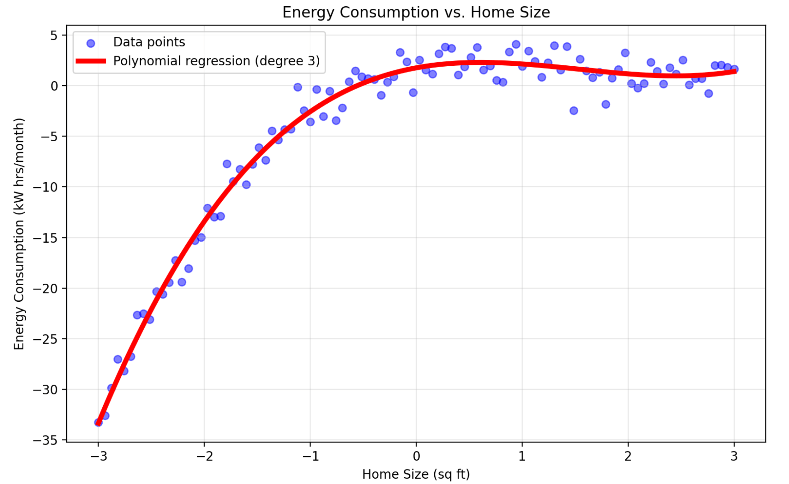

# Introduction

**Polynomial Regression is** an extension where the relationship between variables is non-linear. Polynomial regression transforms input variables to higher powers (e.g., $$x2,x3x^2, x^3x2,x3$$) but remains a linear model concerning the parameters, making it suitable for more complex patterns.

In polynomial regression, we aim to model a non-linear relationship by transforming the input variable x to include higher powers. The model equation for a polynomial regression of degree $$d$$ is:

$$y = \beta_0 + \beta_1 x + \beta_2 x^2 + \beta_3 x^3 + \dots + \beta_d x^d + \epsilon$$\
\
where:

• $$y$$ is the dependent variable,

• $$\beta_0, \beta_1, \beta_2, \dots, \beta_d$$ are the coefficients,

• $$x, x^2, x^3, \dots, x^d$$ represent the transformed input features up to the $$d$$-th degree,

• $$\epsilon$$ is the error term.

This transformation allows the model to fit a curve that better matches non-linear patterns in the data.

**Example:**

Predicting energy consumption based on home size.

<figure><figcaption>
Polynomial Regression
</figcaption></figure>

