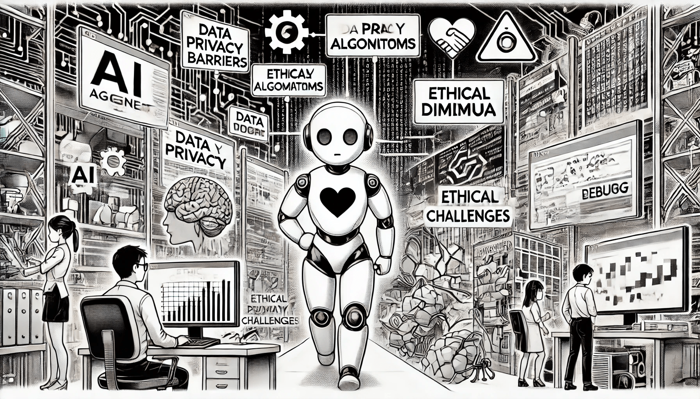

# Проблемы разработки агентов ИИ

В быстро развивающейся области искусственного интеллекта создание ИИ-агентов связано с уникальными и сложными вызовами. Ключевые аспекты, вызывающие беспокойство, включают масштабируемость, координацию, обучение и адаптацию, а также этику и доверие. Решение этих проблем имеет решающее значение для повышения эффективности, производительности и общественного принятия ИИ-агентов.

<figure><figcaption>
Проблемы разработки агентов ИИ
</figcaption></figure>

Проблемы разработки ИИ-агентов

1\. Масштабируемость: работа в сложных и больших средах

С развитием ИИ-агенты внедряются в всё более сложные и масштабные среды, что делает масштабируемость одной из ключевых проблем. Агенты, предназначенные для работы в реальных приложениях — таких как автономные транспортные средства, климатическое моделирование или градостроительство, — должны обрабатывать огромные объемы данных и принимать быстрые и надежные решения в непредсказуемых условиях. Однако масштабирование ИИ для обработки высокоразмерных данных, связанных с такими средами, требует значительных вычислительных ресурсов и часто оказывается дорогостоящим. Решению этих вопросов способствуют инновации в области распределённых вычислений, такие как периферийные вычисления (edge computing) и облачные технологии. Кроме того, оптимизация алгоритмов для снижения потребления ресурсов и повышения скорости обработки имеет ключевое значение для масштабируемости.

2\. Координация: обеспечение эффективного взаимодействия между несколькими агентами

Во многих сценариях эффективные ИИ-агенты должны работать в командах, делясь информацией, согласовывая действия и динамически распределяя задачи. Обеспечение эффективной координации между агентами требует надёжных протоколов связи и общего понимания целей. Например, в сетях автономного транспорта несколько транспортных средств должны координировать свои действия, чтобы избежать аварий, улучшить поток трафика и оптимизировать расход топлива. Эта координация представляет собой сложную задачу, поскольку включает преодоление барьеров в коммуникации, управление зависимостями и разрешение конфликтов в случае расхождения целей агентов. Эффективная координация часто основывается на передовых техниках многогентного обучения, методах обучения с подкреплением и алгоритмах, основанных на консенсусе, которые обеспечивают плавное взаимодействие и согласованность между агентами.

3\. Обучение и адаптация: работа в непредсказуемых условиях

ИИ-агенты, работающие в реальных условиях, должны адаптироваться к неожиданным событиям и постоянно учиться на новых данных. Однако обучить агентов для работы во всех возможных сценариях практически невозможно. Традиционные модели ИИ часто испытывают трудности с обобщением и адаптацией, особенно в динамических и хаотичных условиях. Поэтому такие подходы, как метаобучение, непрерывное обучение и самообучение, имеют решающее значение для способности ИИ-агентов быстро обучаться. Возможность переносить знания между задачами также позволяет агентам быстрее адаптироваться, снижая затраты на переобучение и улучшая производительность в различных средах.

4\. Этика и доверие: обеспечение этичного и надёжного поведения ИИ

С развитием интеграции ИИ в общество становится крайне важным установить доверие и этические стандарты. ИИ-агенты должны не только принимать технически обоснованные решения, но и действовать в соответствии с человеческими ценностями, безопасностью и справедливостью. Это требует тщательного учета этических принципов на этапе проектирования, таких как прозрачность, справедливость, подотчётность и согласие пользователя. Меры по укреплению доверия, такие как обеспечение прозрачности процессов принятия решений и снижение предвзятости, имеют важное значение для того, чтобы пользователи чувствовали себя уверенно при взаимодействии с ИИ-системами. Кроме того, соблюдение нормативных требований и руководств в области конфиденциальности, недопущения дискриминации и безопасности создаёт основу для соблюдения ИИ-агентами высоких стандартов поведения.

\

Заключение

\

Создание ИИ-агентов, которые могут эффективно масштабироваться, координировать взаимодействие, адаптироваться к динамическим средам и действовать этично, — это сложная, но необходимая задача для разработки надёжных, устойчивых и полезных для общества систем ИИ. Дальнейший прогресс в этих областях потребует междисциплинарного сотрудничества и акцента на ответственную практику применения ИИ.

