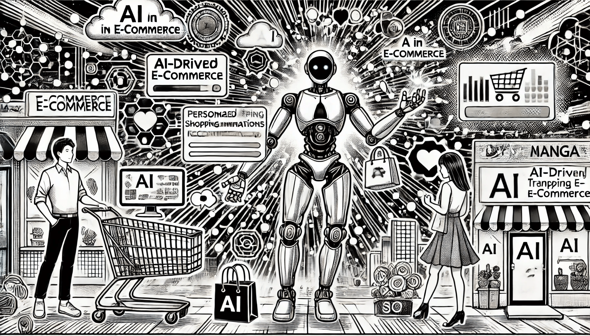

# ИИ в электронной коммерции

### Революция в онлайн-шопинге

Искусственный интеллект преобразует мир электронной коммерции, персонализируя покупки, оптимизируя цепочки поставок и улучшая обслуживание клиентов. От предсказательной аналитики до персонализированных рекомендаций — ИИ стимулирует эффективность, вовлеченность и рост онлайн-ритейлеров. Давайте рассмотрим, как ИИ меняет электронную коммерцию (e-commerce).

<figure><figcaption>
ИИ в электронной коммерции
</figcaption></figure>

### Персонализированные рекомендации

Одно из самых известных применений ИИ в e-commerce — это персональные рекомендации товаров. Алгоритмы ИИ анализируют поведение покупателей, историю покупок и их поисковые запросы, чтобы предложить продукты, соответствующие индивидуальным предпочтениям. Это не только повышает удовлетворенность клиентов, но и стимулирует продажи, вызывая желание сделать незапланированную покупку.

Например, рекомендательная система **Amazon** анализирует огромные объемы данных из взаимодействий пользователей, предлагая персональные товары на основе истории просмотров, прошлых покупок и похожих профилей клиентов. **Netflix**, хотя и является стриминговой платформой, также использует ИИ для рекомендаций контента, демонстрируя, как ИИ повышает вовлеченность пользователей в различных отраслях.

### Предсказательная аналитика для прогнозирования спроса

ИИ меняет подход к прогнозированию спроса и управлению запасами. Модели машинного обучения анализируют данные о продажах, рыночные тенденции и внешние факторы, такие как сезонные изменения или экономические условия, чтобы предсказать будущий спрос. Это позволяет ритейлерам оптимизировать запасы, уменьшать отходы и избегать нехватки или избытка товаров.

Компании, такие как **Walmart**, используют ИИ для прогнозирования спроса и соответствующего управления цепочкой поставок. Прогнозируя, какие товары будут пользоваться высоким спросом, Walmart обеспечивает наличие нужных запасов в нужное время, сокращая затраты на логистику и повышая удовлетворенность покупателей.

### Чат-боты и виртуальные ассистенты

Чат-боты и виртуальные ассистенты на основе ИИ меняют клиентский сервис в e-commerce. Эти интеллектуальные системы могут обрабатывать широкий спектр запросов, от информации о продуктах и отслеживания заказов до решения проблем. Обеспечивая мгновенную поддержку 24/7, чат-боты улучшают клиентский опыт и снижают нагрузку на представителей службы поддержки.

Компании, такие как **H\&M** и **Sephora**, используют ИИ чат-ботов на своих сайтах и в приложениях, чтобы сопровождать клиентов на всех этапах покупок. Виртуальный ассистент Sephora может рекомендовать продукты на основе предпочтений пользователя, отвечать на вопросы о наличии товаров и даже давать советы по красоте, создавая удобный и интересный процесс покупок.

### Визуальный поиск и распознавание изображений

Технология визуального поиска на основе ИИ позволяет клиентам находить товары, загружая изображения вместо того, чтобы вводить текстовый запрос. Это особенно полезно в сфере моды и декора, где покупателям сложно описать желаемый товар. ИИ анализирует загруженные изображения, находит похожие товары в каталоге и предлагает рекомендации.

**Pinterest** внедрил ИИ в функцию визуального поиска, что позволяет пользователям фотографировать товары и находить похожие предметы на платформе. Аналогично, **ASOS** предлагает инструмент визуального поиска, который помогает покупателям найти одежду, похожую на ту, которую они видят в реальной жизни, упрощая покупки и повышая вовлеченность.

### Динамическое ценообразование

ИИ также меняет подход к ценообразованию в e-commerce, применяя модели динамического ценообразования. Алгоритмы ИИ анализируют цены конкурентов, колебания спроса и другие рыночные факторы для автоматической корректировки цен в реальном времени, что позволяет ритейлерам оставаться конкурентоспособными и при этом увеличивать прибыль.

Например, **Uber** использует динамическое ценообразование на основе ИИ, чтобы корректировать стоимость поездок в зависимости от спроса, дорожной обстановки и погодных условий. В e-commerce платформы, такие как **Shopify**, применяют аналогичные ИИ-модели для онлайн-ритейлеров, помогая им корректировать цены на основе актуальных данных и оптимизировать продажи и доходы.

### Оптимизация цепочки поставок и логистики

ИИ упрощает логистику в e-commerce, оптимизируя цепочки поставок, улучшая управление складами и ускоряя доставку. Системы на основе ИИ анализируют такие факторы, как прогнозы спроса, затраты на транспортировку и надежность поставщиков, чтобы принимать более обоснованные решения о размещении товаров и маршрутах доставки.

Компания **Alibaba** активно использует ИИ в своей логистической сети **Cainiao** для оптимизации цепочки поставок. Предсказывая наиболее эффективные маршруты доставки и расположение складов, ИИ помогает сократить сроки и расходы на доставку. Компания **Ocado** из Великобритании, занимающаяся онлайн-торговлей продуктами, использует ИИ для управления автоматизированными складами, где роботы быстро и точно комплектуют и отправляют заказы.

### Обнаружение и предотвращение мошенничества

ИИ также повышает безопасность в e-commerce, выявляя мошеннические действия. Алгоритмы машинного обучения анализируют транзакции для выявления подозрительного поведения, такого как необычные суммы покупок или способы оплаты, что снижает риск мошенничества.

**PayPal** использует системы обнаружения мошенничества на основе ИИ, которые анализируют миллиарды транзакций для выявления потенциального мошенничества в реальном времени. Эти системы отмечают подозрительные транзакции и предотвращают мошенническую активность ещё до того, как она нанесет ущерб бизнесу или клиентам.

### Будущее e-commerce с ИИ

ИИ приводит к революции в e-commerce, от персонализированных рекомендаций и чат-ботов до оптимизации цепочек поставок и защиты от мошенничества. По мере развития технологий ИИ, онлайн-шопинг станет еще более персонализированным, эффективным и безопасным, делая e-commerce умнее и ориентированнее на клиентов.
