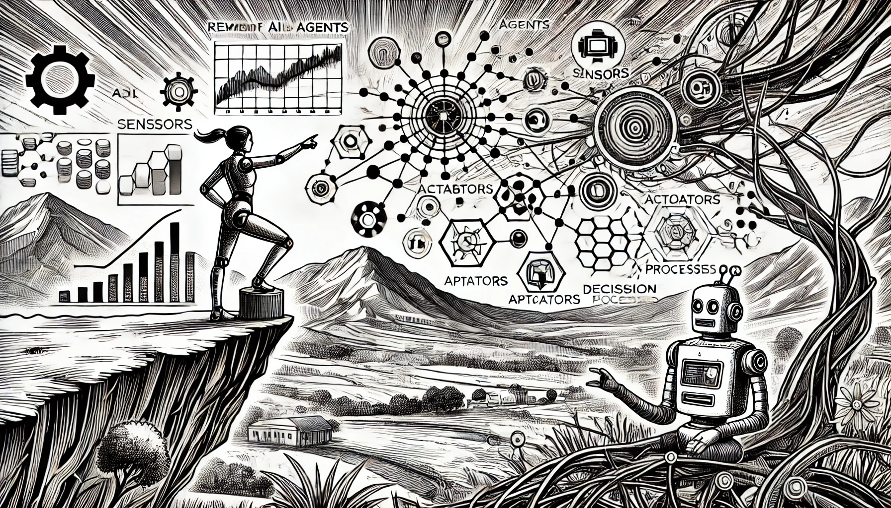

# ИИ в образовании

### Формируем будущее обучения

Искусственный интеллект преобразует сферу образования, предлагая новые инструменты и методы для персонализированного обучения, автоматизации административных задач и улучшения общего учебного опыта студентов. От адаптивных образовательных платформ до интеллектуальных репетиторских систем – ИИ меняет подходы к обучению, преподаванию и работе учебных заведений. Давайте рассмотрим, как ИИ влияет на современное образование.

<figure><figcaption>
ИИ в образовании
</figcaption></figure>

### Персонализированное обучение

Способность ИИ анализировать данные и подстраиваться под индивидуальные стили обучения сделала персонализированное обучение одной из самых преобразующих технологий в образовании. Оценивая сильные и слабые стороны ученика, а также его предпочтения, ИИ может адаптировать учебный контент под конкретные нужды, создавая уникальный образовательный опыт.

Например, платформы **DreamBox** и **Knewton** используют ИИ, чтобы регулировать сложность заданий и предоставлять персонализированные отзывы, обеспечивая постоянный интерес и избегая перегрузки. Системы отслеживают прогресс студентов в реальном времени, предлагая дополнительные упражнения и ресурсы по мере необходимости. Такой подход обеспечивает каждому учащемуся уникальный путь, что увеличивает его шансы на успех в обучении.

### Интеллектуальные репетиторские системы

Интеллектуальные репетиторские системы на основе ИИ предоставляют индивидуальные занятия, помогая студентам осваивать предметы без постоянного вмешательства другого человека. Такие системы могут отвечать на вопросы, давать обратную связь и объяснения в реальном времени, выполняя роль личного репетитора.

Например, **Carnegie Learning** использует ИИ для улучшения математических навыков учащихся. Система подстраивается под темп студента, предлагая подсказки или изменяя сложность задач в зависимости от их успехов. Ещё один известный репетитор на основе ИИ — **MATHia**, который помогает ученикам, предлагая упражнения, основанные на их сильных и слабых сторонах.

### Автоматизация административных задач

ИИ также помогает преподавателям и учебным заведениям автоматизировать административные задачи, освобождая время для преподавания и взаимодействия со студентами. Проверка экзаменов, учёт посещаемости и организация учебных материалов — задачи, которые можно упростить с помощью ИИ.

Например, **Gradescope** — платформа, использующая ИИ для более быстрой проверки экзаменов и заданий. Автоматизация процесса оценки позволяет преподавателям больше времени уделять персонализированным отзывам и наставничеству студентов. ИИ также помогает с задачами, такими как приём студентов и составление расписания, повышая эффективность административных процессов.

### Платформы обучения на базе ИИ

Образовательные платформы на основе ИИ создают более интерактивные и увлекательные образовательные среды. Виртуальные классы и онлайн-платформы, использующие ИИ, могут подстраиваться под темп каждого ученика, предоставлять обратную связь и предлагать персонализированный контент.

К примеру, **Coursera** и **EdX** используют ИИ для подбора курсов для студентов на основе их интересов, успеваемости и опыта. Эти платформы также анализируют вовлечённость студентов, предлагая дополнительные материалы, такие как дополнительное чтение или практические задания.

### Поддержка преподавателей

ИИ поддерживает не только студентов, но и преподавателей. Системы на основе ИИ анализируют данные учащихся, чтобы выявлять закономерности в обучении и помогать учителям понимать, кому из учеников требуется дополнительная поддержка, а кто, наоборот, успешно продвигается.

Инструменты, такие как **Smart Content**, используют ИИ для создания адаптированных учебных планов, помогая преподавателям разрабатывать более качественные материалы. ИИ также помогает создавать тесты и экзамены, сокращая время, которое учителя тратят на разработку учебного контента.

### ИИ в специальном образовании

ИИ играет важную роль в специальном образовании, предлагая инструменты, которые учитывают потребности учеников с нарушениями обучения. Приложения на базе ИИ могут помочь ученикам с дислексией, СДВГ и другими трудностями, предоставляя персонализированные учебные среды и ресурсы, соответствующие их уникальным потребностям.

Например, инструменты распознавания речи на базе ИИ помогают учащимся с ограничениями в письменной речи и коммуникации, а приложения, такие как **Kurzweil 3000**, предоставляют поддержку с функциями озвучивания текста и улучшения понимания. Эти инструменты создают инклюзивную учебную среду, позволяя ученикам с особыми потребностями раскрыть свой потенциал.

### Прогностическая аналитика в образовании

Прогностическая аналитика на основе ИИ помогает учебным заведениям прогнозировать результаты студентов, такие как риск отчисления, основываясь на факторах, таких как посещаемость, участие и успеваемость. Благодаря раннему выявлению учеников из группы риска преподаватели могут вовремя оказывать поддержку и улучшать показатели успеваемости.

Например, **Purdue University** использует прогностическую аналитику с системой **Course Signals**, которая отслеживает успеваемость и вовлечённость студентов, чтобы прогнозировать их шансы на успех. Затем система предлагает индивидуальную поддержку, помогая учащимся, испытывающим трудности, вернуться в строй.

### Будущее образования с ИИ

ИИ привносит значительные изменения в образование, делая обучение более персонализированным, доступным и эффективным. От интеллектуальных репетиторских систем и персонализированных образовательных платформ до инструментов автоматизации административных процессов и поддержки в специальном образовании — ИИ помогает как студентам, так и преподавателям достигать лучших результатов. По мере развития ИИ его роль в образовании будет становиться всё более значимой, формируя будущее обучения в современном мире.

