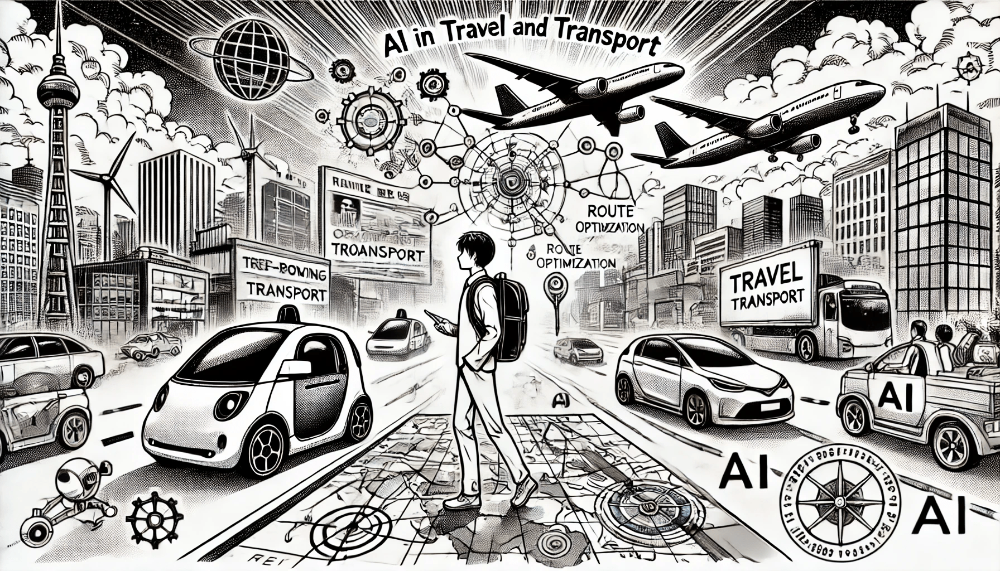

# ИИ в путешествиях и на транспорте

### Революция в наших перемещениях

Искусственный интеллект меняет мир путешествий и транспорта, делая поездки более удобными, безопасными и персонализированными. От планирования путешествия до передвижения по городам и даже полетов — во всём этом ИИ играет ключевую роль в том, чтобы изменить наш подход к передвижениям. Давайте рассмотрим несколько ключевых областей, в которых ИИ оказывает значительное влияние, приводя примеры из реальной жизни.

<figure><figcaption>
ИИ в путешествиях и на транспорте
</figcaption></figure>

### Умное планирование поездок

ИИ революционизировал процесс планирования путешествий. Больше нет необходимости искать среди бесконечных сравнений рейсов и отзывов о гостиницах. Алгоритмы ИИ теперь выполняют всю трудоемкую работу, анализируя предпочтения, поведение в прошлом и тенденции, чтобы предложить вам подходящие варианты путешествий.&#x20;

Например, **Skyscanner** использует ИИ для сравнения миллионов цен на авиабилеты, гостиницы и аренду автомобилей в режиме реального времени, предоставляя пользователям персонализированные рекомендации. **Hopper** идет ещё дальше, предсказывая будущие цены с помощью машинного обучения и уведомляя пользователей, когда лучше всего бронировать, чтобы получить самые низкие цены. Эти инструменты не только экономят время, но и помогают вам принимать экономически выгодные решения о поездке.

### Оптимизация транспортных сетей

Городской транспорт стал намного эффективнее благодаря ИИ. В городах ИИ используется для предсказания трафика, оптимизации маршрутов и улучшения расписания общественного транспорта. Это помогает снизить уровень пробок и сократить время поездок.&#x20;

Например, в Сингапуре ИИ управляет умной системой движения, анализируя данные о трафике в реальном времени для регулирования светофоров и перенаправления машин на менее загруженные дороги, предотвращая возникновение пробок. Приложение **Moovit**, управляемое ИИ, помогает пассажирам ориентироваться в общественном транспорте, предоставляя лучшие маршруты с учетом текущей дорожной обстановки и задержек. Такая динамическая маршрутизация делает ежедневные поездки более предсказуемыми и удобными.

### Оптимизация маршрутов

ИИ не только помогает ориентироваться в городах, но и играет значительную роль в оптимизации маршрутов грузовых автомобилей, такси и логистических сетей. Анализируя дорожные условия, погодные данные и историческую информацию, ИИ обеспечивает оптимальный путь для транспортных средств, экономя время, топливо и затраты. Например, компания&#x20;

**UPS** использует свою систему «**ORION**», работающую на базе ИИ, для оптимизации маршрутов доставки. Система учитывает не только трафик, но и особые запросы клиентов и сроки доставки, что приводит к значительной экономии топлива и времени. Платформы совместного использования поездок, такие как **Uber**, также используют алгоритмы ИИ для определения самых быстрых маршрутов для водителей, учитывая текущие дорожные условия и обеспечивая более быструю и эффективную поездку для пассажиров.

### Аэропорты на базе ИИ

Аэропорты внедряют ИИ для оптимизации работы и улучшения впечатлений пассажиров от поездки. От регистрации до посадки на рейс ИИ помогает автоматизировать и ускорять процессы, делая воздушные путешествия менее стрессовыми.&#x20;

Например, в **аэропорту** **Чанги** в Сингапуре используется распознавание лиц на базе ИИ для автоматизации регистрации, проверки безопасности и посадки. Пассажиры могут передвигаться по аэропорту с меньшим количеством физических проверок, полагаясь на сканирование лиц для подтверждения личности. Кроме того, роботы на базе ИИ выполняют задачи, такие как уборка и обработка багажа, повышая операционную эффективность и позволяя сотрудникам сосредоточиться на более важных задачах.

### Умные системы безопасности

Проверка безопасности в аэропортах, зачастую занимающая много времени, становится быстрее и точнее благодаря ИИ. Системы ИИ могут анализировать изображения багажа, сканируемые на экранах, для выявления потенциальных угроз с большей точностью, чем это делают люди, ускоряя процесс.&#x20;

**Управление транспортной безопасности (TSA)** в США использует системы на базе ИИ для автоматизации сканирования багажа и улучшения проверок безопасности. Эти системы используют глубокое обучение для обнаружения опасных предметов в режиме реального времени, что значительно снижает количество ошибок. Пассажиры в аэропортах, таких как **Хитроу** в Лондоне, уже пользуются преимуществами ИИ в проверке безопасности, что делает процесс сканирования гораздо быстрее и уменьшает очереди.

### Прогнозируемое обслуживание

ИИ играет важную роль в обеспечении надежности и безопасности транспортных систем. Анализируя данные с транспортных средств или самолетов, ИИ может предсказать, когда вероятно возникновение поломки, что позволяет провести техническое обслуживание до возникновения неисправности. Это минимизирует простой и повышает безопасность.&#x20;

Например, **Delta Airlines** использует ИИ для анализа данных с тысяч датчиков на самолетах. Такой подход к прогнозируемому обслуживанию позволяет выявлять потенциальные проблемы до их критического развития, сокращая задержки, вызванные неожиданными отказами оборудования, и повышая надежность всего флота.&#x20;

**BMW** также использует ИИ в своей системе прогнозируемого обслуживания для уведомления водителей о необходимости ремонта, основываясь на данных, собранных во время ежедневного использования. Такой подход не только продлевает срок службы автомобиля, но и снижает вероятность неожиданных поломок. Компании по управлению автопарком также используют прогнозируемое обслуживание для минимизации простоя коммерческих транспортных средств, экономя на ремонтах и предотвращая неисправности.

### Улучшение обслуживания клиентов

ИИ также используется для улучшения обслуживания клиентов в сфере путешествий. Чат-боты, виртуальные помощники и системы поддержки клиентов на базе ИИ помогают путешественникам быстро и эффективно получать необходимую информацию.&#x20;

Например, **KLM Royal Dutch Airlines** использует чат-бота на базе ИИ, который обрабатывает запросы клиентов на различных платформах, включая социальные сети. Чат-бот может отвечать на часто задаваемые вопросы, предоставлять актуальную информацию о рейсах и помогать с бронированиями на нескольких языках. Такой оперативный сервис повышает качество обслуживания клиентов и позволяет авиакомпаниям эффективно справляться с большим объемом запросов.

### Будущее путешествий и транспорта с ИИ

Влияние ИИ на путешествия и транспорт очевидно. От помощи в планировании идеальной поездки до обеспечения более комфортных поездок в трафике или безопасных полетов — ИИ делает наше передвижение более эффективным и приятным. По мере развития технологий, способы нашего передвижения по миру будут продолжать меняться, предлагая ещё больше удобства и безопасности.
