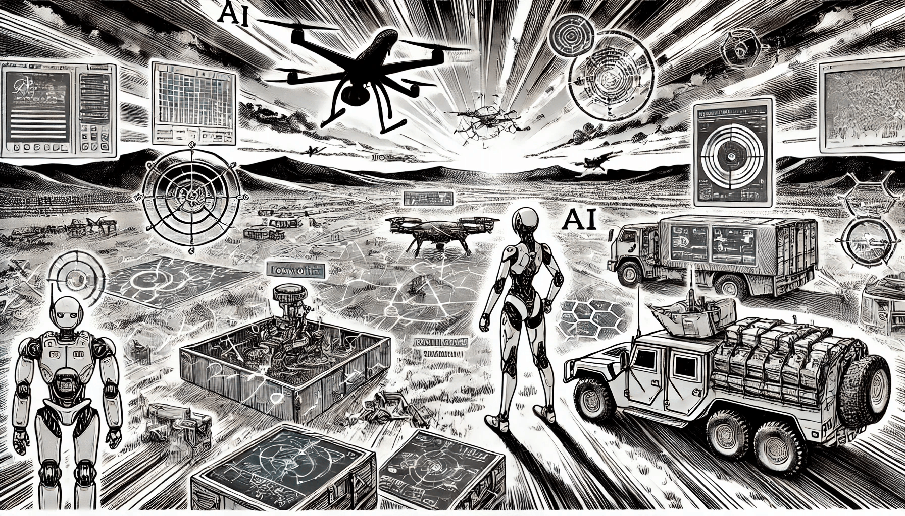

# ИИ в военной сфере

### Революция в войне и обороне

Искусственный интеллект стремительно трансформирует военную сферу, повышая возможности в таких областях, как наблюдение, принятие решений и автономные системы вооружения. Внедрение ИИ в военные операции меняет характер современной войны, предлагая возможности для большей точности, эффективности и стратегического преимущества. Однако растущая зависимость от ИИ в обороне также вызывает значительные этические, правовые и вопросы безопасности, особенно когда речь идет о разработке автономных оружейных систем и рисках непредвиденных последствий в вооруженных конфликтах.

<figure><figcaption>
ИИ в военной сфере
</figcaption></figure>

### Автономные оружейные системы

Одним из наиболее значимых применений ИИ в военной сфере является разработка автономных оружейных систем, часто называемых “роботами-убийцами”. Эти системы на базе ИИ способны идентифицировать, целиться и уничтожать угрозы без прямого вмешательства человека. Автономные дроны, наземные и морские аппараты разрабатываются для выполнения таких миссий, как наблюдение, разведка и даже ведение боевых действий.

Например, дрон **X-47B** — автономный беспилотный боевой летательный аппарат, разработанный Военно-морскими силами США, может взлетать, выполнять полет и приземляться без участия пилота. Такие системы обладают преимуществами, такими как снижение человеческих потерь, повышение гибкости миссий и выполнение сложных операций в условиях, где вмешательство человека было бы рискованным. Однако возникает все больше вопросов об этических аспектах предоставления машинам права принимать решения о жизни и смерти на поле боя.

### ИИ в наблюдении и разведке

ИИ играет ключевую роль в усилении возможностей наблюдения и разведки, обрабатывая огромные объемы данных со спутников, датчиков и дронов. Системы на базе ИИ способны анализировать видеоданные, выявлять необычные паттерны и даже предсказывать потенциальные угрозы на основе поведенческих данных. Это позволяет военным силам более эффективно и в реальном времени собирать критически важную информацию.

Например, инициатива **Project Maven** Министерства обороны США использует ИИ для обработки и анализа съемок с дронов, что позволяет быстрее и точнее идентифицировать объекты и людей. Способность ИИ оперативно обрабатывать огромные массивы данных улучшает военное принятие решений, помогая командирам более эффективно реагировать на возникающие угрозы.

### Кибербезопасность и защита с помощью ИИ

С ростом значимости кибервойны как части современных конфликтов ИИ используется для укрепления кибербезопасности и защиты военных сетей от атак. Системы на основе ИИ могут отслеживать и анализировать сетевой трафик, обнаруживать аномалии и реагировать на киберугрозы в реальном времени. Алгоритмы машинного обучения также применяются для прогнозирования и предотвращения возможных кибератак до их возникновения.

Например, такие инструменты, как **Darktrace**, используют машинное обучение для выявления подозрительной активности в сети, которая может указывать на кибератаку. Анализируя огромные объемы данных, эти системы способны обнаруживать сложные киберугрозы, помогая военным организациям защищаться от попыток взлома, утечек данных и других киберугроз.

### ИИ для стратегического принятия решений

ИИ также используется для повышения эффективности стратегического военного принятия решений, обрабатывая огромные объемы данных и предоставляя догадки и подсказки, которые не всегда очевидны для аналитиков. Алгоритмы машинного обучения могут анализировать исторические данные, текущие события и условия на поле боя, чтобы давать военным лидерам рекомендации, основанные на данных, по перемещению войск, логистике и оперативным стратегиям.

**Центр искусственного интеллекта Минобороны США (JAIC)** сосредоточен на интеграции ИИ в военные операции, включая системы поддержки принятия решений. Платформы на базе ИИ могут помогать командирам, моделируя различные сценарии на поле боя, анализируя исходы и предоставляя рекомендации по наилучшим действиям.

### Автономная логистика и цепочки поставок

ИИ также меняет военную логистику и цепочки поставок, автоматизируя такие процессы, как управление запасами, транспортировка и распределение снабжения. Автономные системы могут использоваться для доставки припасов войскам в отдаленных или опасных местах, снижая необходимость участия человека в миссиях с высоким уровнем риска.

Например, автономные наземные машины, такие как **TARDEC** (Центр исследований и разработок танковой автомобильной техники), разрабатываются для транспортировки оборудования и припасов по полю боя. Логистические системы на базе ИИ могут анализировать данные цепочки поставок для оптимизации распределения ресурсов, гарантируя, что войска получат необходимое снабжение вовремя.

### Будущее военной сферы с ИИ

Интеграция ИИ в военную сферу представляет собой значительный шаг вперед в технологической войне. Несмотря на то что ИИ предоставляет существенные преимущества в эффективности, точности и принятии решений, он также вызывает этические вопросы, особенно в связи с использованием автономных оружейных систем и возможными непредвиденными последствиями. По мере эволюции ИИ его роль в военных операциях, вероятно, будет расти, вызывая важные вопросы о будущем войны и глобальной безопасности.
