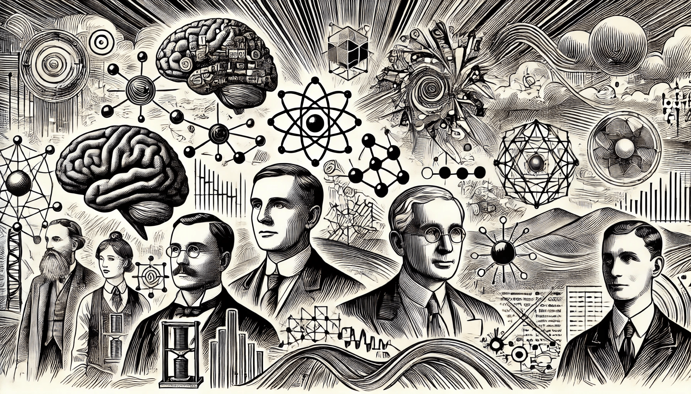
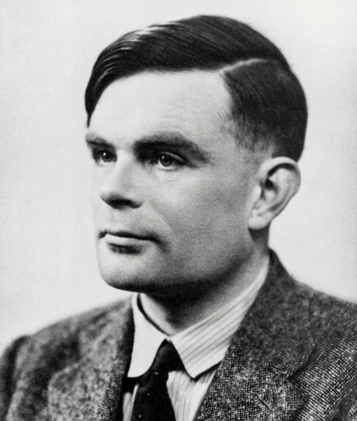
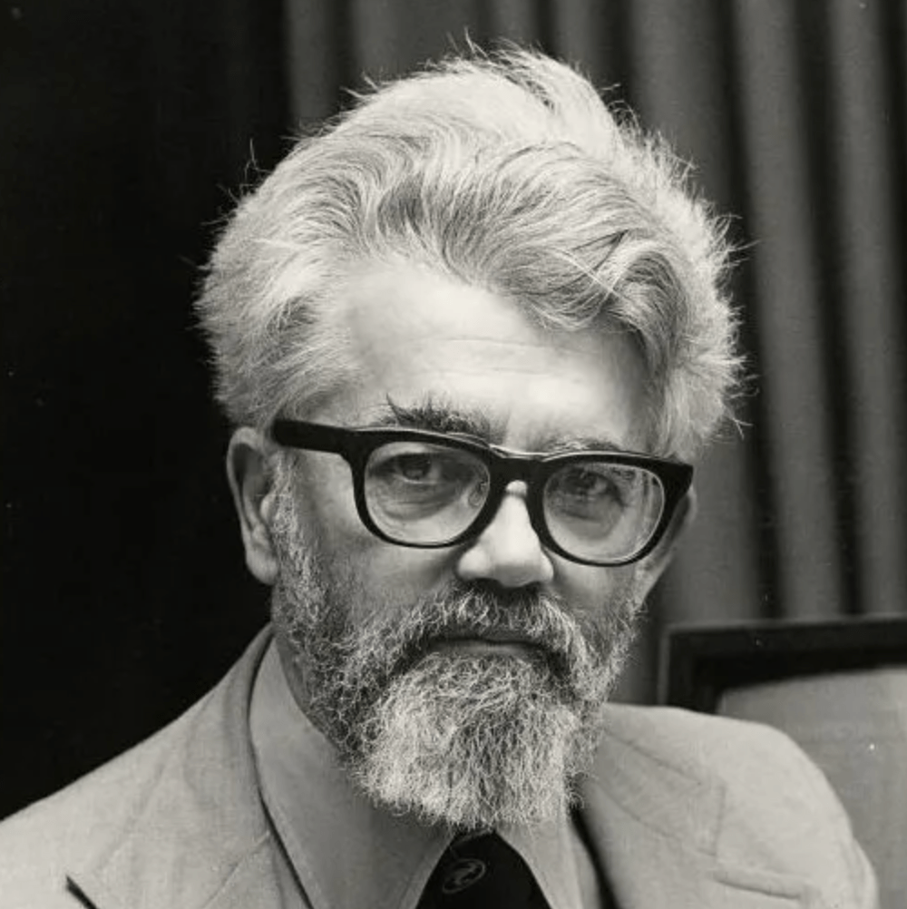
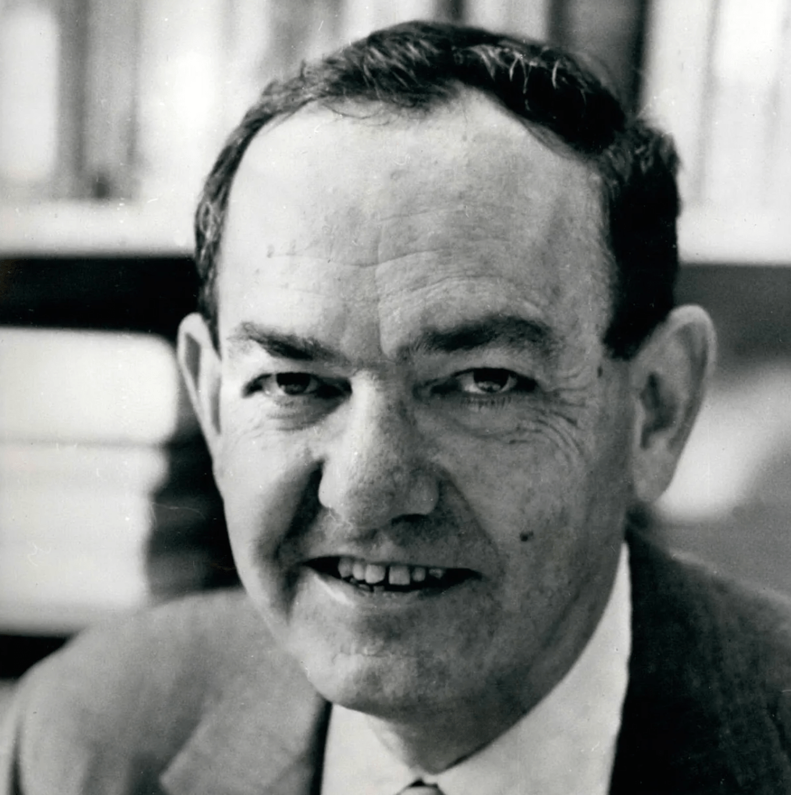
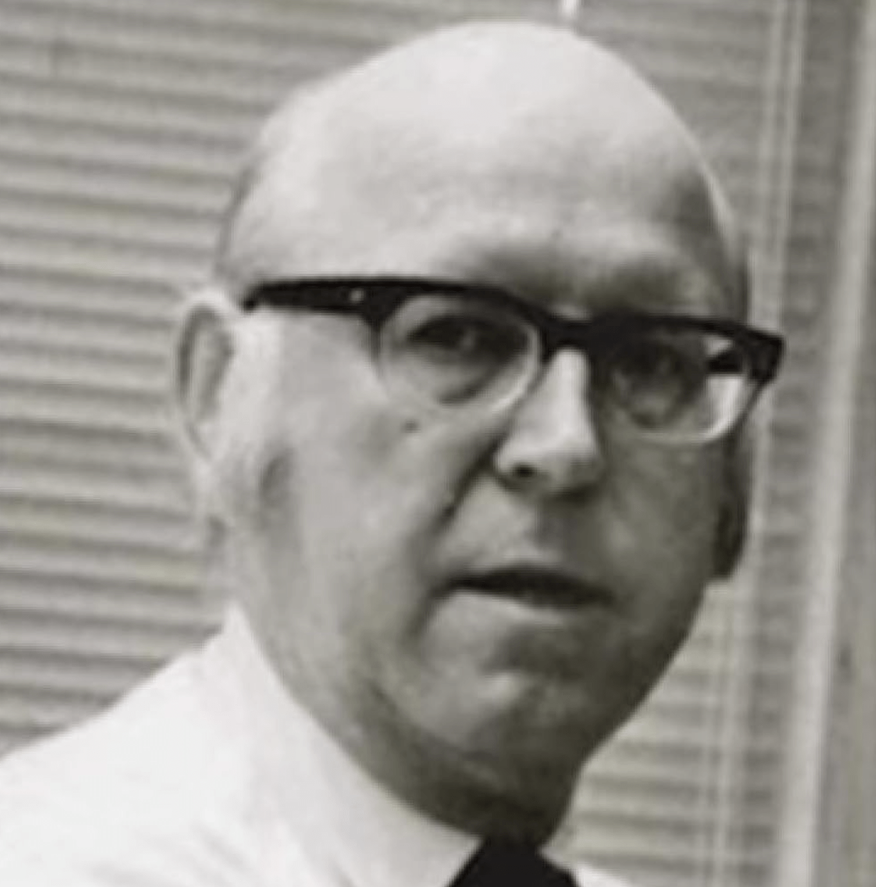

# История ИИ

### От мифа до современного чуда

Идея искусственного интеллекта не нова — её корни уходят в древние мифы, такие как мифология Древней Греции, где впервые был представлен образ разумных машин (подробнее в разделе “[История машинного обучения](../../mashinnoe-obuchenie/obzor-mo/istoriya-mashinnogo-obucheniya/)”). Но ИИ в его современном понимании начал формироваться в 1950-х годах. Именно тогда ученые-компьютерщики всерьез задумались, могут ли машины учиться, решать задачи и даже мыслить, как люди.

<figure><figcaption>
Ключевые вклады и влиятельные личности
</figcaption></figure>

Одним из первопроходцев в этой области стал британский математик Алан Тьюринг. В 1950 году он предложил знаменитый тест Тьюринга — простой, но мощный способ определить, может ли машина демонстрировать настолько разумное поведение, чтобы ввести человека в заблуждение и заставить его думать, что перед ним тоже человек. Это вызвало волну исследований и экспериментов, в которых ученые пытались создавать машины, способные играть в шахматы, решать математические задачи и понимать человеческий язык.

С тех пор ИИ прошел очень долгий путь. В 1980-х и 90-х годах основное внимание уделялось экспертным системам, которые пытались воспроизвести процесс принятия решений, характерный для человека. Примерно с 2000-х годов использование больших данных вышло на совершенно новый уровень, а мощные вычислительные ресурсы привели к прорывам в машинном обучении, глубоком обучении и применении ИИ. Машины перестали ограничиваться играми и головоломками — они начали распознавать лица, понимать речь и даже управлять автомобилями без участия человека.

### Ключевые вклады и влиятельные личности

Область искусственного интеллекта  была сформирована вкладом как ранних исследователей, заложивших для неё основу, так и современных новаторов, которые и сегодня продолжают расширять горизонты этой области. Рассмотрим некоторые ключевые фигуры в истории ИИ, разделенные на две категории: первопроходцы и визионеры, а также современные новаторы.

### Первопроходцы и визионеры&#x20;

Раннее развитие ИИ было обусловлено работой блестящих умов, идеи которых заложили основу того, чем эта область стала сегодня. Эти первопроходцы представляли себе будущее, в котором машины могли бы думать, учиться и адаптироваться — идеи, которые своего времени были совершенно революционными.

#### 1. Алан Тьюринг&#x20;

<figure><figcaption>
Алан Тьюринг
</figcaption></figure>

Алан Тьюринг, часто называемый отцом современной компьютерной науки, в своей работе 1950 года «Вычислительная техника и интеллект» поставил знаменитый вопрос: «Могут ли машины мыслить?». В ней Тьюринг ввел концепцию теста Тьюринга — метода определения того, может ли машина демонстрировать разумное поведение, неотличимое от поведения человека. Эта работа Тьюринга заложила концептуальную основу для ИИ, исследуя идею машинного обучения и искусственного мышления.

#### 2. Джон Маккарти&#x20;

<figure><figcaption>
Джон Маккарти
</figcaption></figure>

В 1956 году Джон Маккарти ввел термин «искусственный интеллект» во время Дартмутской конференции, которая считается рождением ИИ как отдельной области изучения. Вклад Маккарти включает разработку Lisp, языка программирования, широко используемого в исследованиях ИИ. Его работа в области символического рассуждения и решения проблем помогла установить основные области ранних исследований ИИ, особенно в подходах, основанных на логике.

#### 3. Марвин Мински&#x20;

<figure><figcaption>
Марвин Мински
</figcaption></figure>

Соучредитель Лаборатории ИИ Массачусетского технологического института, Марвин Мински был ещё одним первопроходцем, внесшим значительный вклад в ИИ. Его работа была сосредоточена на человеческом познании и архитектуре интеллекта, исследуя, как машины могут имитировать человеческое мышление. Мински считал, что ИИ можно и нужно использовать для понимания природы человеческого интеллекта, и внес вклад в ранние разработки в области робототехники и нейронных сетей.

#### 4. Герберт А. Саймон и Аллен Ньюэлл

<figure><figcaption>
Герберт А. Саймон
</figcaption></figure>

Саймон и Ньюэлл сыграли важную роль в создании одной из первых программ ИИ, Logic Theorist, в 1955 году. Их работа представила идею эвристического решения проблем в машинах, имитирующих человеческие рассуждения. Затем они разработали General Problem Solver, который мог решать широкий спектр задач с помощью абстрактных рассуждений, что стало одним из самых первых практических приложений ИИ.&#x20;

<figure><figcaption>
Аллен Ньюэлл
</figcaption></figure>

Эти первопроходцы обладали дальновидностью и смелостью задаться вопросом, чего могут достичь машины, заложив тем самым основу для будущих прорывов.

### Современные новаторы&#x20;

В то время как первые исследователи заложили основу для ИИ, современные новаторы в последние годы способствовали его быстрому развитию. С появлением более мощных вычислений и ростом машинного обучения ИИ превратился в важнейшую область, влияющую на различные отрасли жизни человека, от здравоохранения до работающих автономных систем. Вот некоторые из ведущих деятелей, стоящих за этой революцией.

#### 1. Джеффри Хинтон&#x20;

Работа Джеффри Хинтона, которого широко считают «крёстным отцом глубокого обучения», сыграла решающую роль в возрождении нейронных сетей. Его разработка обратного распространения в 1980-х годах, наряду с более поздними достижениями в области глубокого обучения, произвела революцию в области ИИ. Работа Хинтона привела к прорывам в распознавании речи, компьютерном зрении и обработке естественного языка, а его исследования проложили путь к созданию моделей ИИ, таких как глубокие нейронные сети и сверточные сети.

#### 2. Янн Лекун

Еще одна ключевая фигура в глубоком обучении, Янн Лекун наиболее известен своим вкладом в сверточные нейронные сети (CNN), которые стали неотъемлемой частью задач компьютерного зрения. Исследования Лекуна помогли добиться значительных успехов в распознавании объектов и классификации изображений. Как ведущий исследователь ИИ и главный научный сотрудник по ИИ в Meta (ранее Facebook), Лекун продолжает работать над новыми возможностями приложений ИИ и машинного обучения.

#### 3. Эндрю Нг

Соучредитель Google Brain и один из самых влиятельных голосов в образовании в области ИИ, Эндрю Нг является видной фигурой в сообществе ИИ. Его работа в области глубокого обучения и его применения для решения масштабных задач оказала глубокое влияние как на академические круги, так и на промышленность. Нг также известен тем, что демократизировал образование в области ИИ с помощью онлайн-курсов, сделав передовые знания доступными для глобальной аудитории.

#### 4. Фей-Фей Ли&#x20;

Фей-Фей Ли — первопроходец в области компьютерного зрения и содиректор Института ИИ, ориентированного на человека, Стэнфордского университета. Она руководила разработкой ImageNet, крупномасштабной визуальной базы данных, которая ускорила прогресс в области глубокого обучения. Успех ImageNet сыграл решающую роль в создании мощных моделей ИИ, которые отлично справляются с распознаванием изображений. Фей-Фей Ли также является сторонником этического ИИ, подчеркивая важность разработки систем ИИ, соответствующих человеческим ценностям.

#### 5. Демис Хассабис

Как соучредитель и генеральный директор DeepMind, Демис Хассабис находится на переднем крае исследований ИИ. AlphaGo от DeepMind, победивший чемпиона мира по игре в го в 2016 году, продемонстрировал потенциал обучения с подкреплением и передовые возможности ИИ. Хассабис продолжает стимулировать исследования в области общего ИИ и нейронных сетей, расширяя возможности того, чего может достичь ИИ, особенно в таких областях, как здравоохранение, сворачивание белков и энергоэффективность.

### Заключение&#x20;

От визионерских работ таких первопроходцев, как Алан Тьюринг и Джон Маккарти, до новаторских достижений современных новаторов, таких как Джеффри Хинтон и Фэй-Фэй Ли, область ИИ была сформирована разнообразной группой мыслителей и исследователей. Каждый из этих людей внес свой вклад в наше понимание интеллекта — естественного или искусственного — и их работа вывела ИИ из теоретических спекуляций в практическую реальность. По мере развития ИИ эти выдающиеся личности продолжают вдохновлять и прокладывать путь для нового поколения инноваций, которые будут формировать наше ближайшее будущее.
