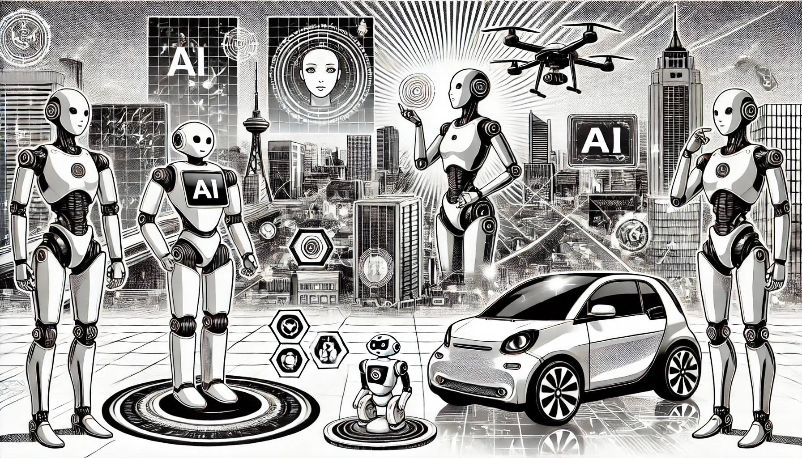

# Типы агентов ИИ

В мире искусственного интеллекта агентом называют любую сущность, которая воспринимает окружающую среду и действует в ней для достижения определённых целей. В зависимости от уровня интеллекта и способности адаптироваться агенты делятся на различные типы. Рассмотрим эти типы подробнее, выделив их уникальные характеристики, механизмы и практическое применение.

<figure><figcaption>
Типы агентов ИИ
</figcaption></figure>

### 1. Простые рефлексные агенты

Простые рефлексные агенты — это самая базовая форма ИИ-агентов. Они принимают решения, основываясь исключительно на текущих условиях окружающей среды, не учитывая историю событий или будущие цели. Такие агенты работают по набору правил «условие-действие», где конкретное восприятие вызывает заранее заданный отклик. Эти агенты эффективны в полностью обозримых и предсказуемых средах, где одни и те же действия всегда приводят к успеху.

<figure><figcaption></figcaption></figure>

**Характеристики**:

* Функционируют на основе заранее заданных правил.
* Не имеют памяти и не учитывают прошлые события.
* Не подходят для сложных или динамичных сред из-за отсутствия адаптивности.

**Примеры**:

* Датчики света, включающие лампу при наступлении темноты.
* Автоматические двери, которые открываются при обнаружении движения.

**Проблемы**:

* **Ограниченная адаптивность**: такие агенты не справляются со средами, требующими гибкости или обучения.
* **Отсутствие памяти**: они не могут понимать сложные ситуации, требующие контекста.
* **Отсутствие долгосрочного планирования**: сосредоточены только на немедленных действиях, без возможности строить стратегии.

_Пример проблемы_: робот-пылесос может застрять в одном углу, так как не помнит предыдущих движений.

### 2. Модельные рефлексные агенты

Модельные рефлексные агенты решают ограничения простых агентов, вводя внутреннюю модель мира. Это позволяет им отслеживать прошлые состояния и понимать, как действия влияют на окружающую среду. Такие агенты могут работать в частично обозримых средах, где текущие восприятия недостаточны для полного понимания ситуации.

<figure><figcaption></figcaption></figure>

**Характеристики**:

* Поддерживают внутреннюю модель окружающей среды.
* Способны запоминать изменения и учитывать историю событий.
* Эффективны в условиях, где окружение изменяется или не полностью наблюдаемо.

**Примеры**:

* Умные термостаты, которые корректируют настройки температуры на основе предыдущих изменений.
* Роботы-пылесосы, запоминающие местоположение препятствий для предотвращения столкновений.

**Проблемы**:

* **Сложность модели**: поддержание точной модели среды в динамичных условиях затруднительно.
* **Ограниченное предсказание**: такие агенты не всегда могут предугадывать будущие состояния.
* **Требовательность к ресурсам**: построение и обновление модели требует вычислительных мощностей.

_Пример проблемы_: Агент в автономном автомобиле может испытывать сложности, если его модель дорожных условий устарела из-за внезапных изменений, например, ремонта дороги.

### 3. Целевые агенты

Целевые агенты идут дальше, внедряя цели, которые направляют их поведение. Вместо простой реакции на текущие условия они оценивают действия, исходя из их способности достичь определённых задач.

<figure><figcaption></figcaption></figure>

**Характеристики**:

* Руководствуются долгосрочными целями.
* Используют алгоритмы для выбора действий, ведущих к достижению целей.
* Применимы там, где задачи требуют последовательности действий.

**Примеры**:

* Автономные роботы-доставщики, прокладывающие маршрут к заданной точке.
* Приложения для планирования маршрутов.

**Проблемы**:

* **Сложность приоритизации целей**: установление и балансировка нескольких задач может быть затруднительной.
* **Высокая вычислительная нагрузка**: планирование требует больших ресурсов и может замедлять принятие решений.
* **Негибкость в изменении целей**: когда цели меняются динамически, адаптация может потребовать перекалибровки всей системы. Это может привести к неэффективности или непреднамеренным действиям, если не справиться с этим должным образом.

_Пример проблемы_: робот-доставщик может испытывать трудности при изменении дорожных условий, что вынуждает его постоянно пересчитывать маршрут.

### 4. Агенты, основанные на полезности

Эти агенты не только достигают целей, но и оценивают качество достижения. Они используют функции полезности, чтобы выбирать действия, максимизирующие удовлетворённость или выгоду.

<figure><figcaption></figcaption></figure>

**Характеристики**:

* Оценивают действия на основе их полезности.
* Оптимизируют качество выполнения задач.
* Идеальны для сложных решений с несколькими вариантами действий.

**Примеры**:

* Системы рекомендаций, подбирающие персонализированные товары.
* Автономные автомобили, выбирающие оптимальный маршрут с учётом трафика и безопасности.

**Проблемы**:

* **Трудности в проектировании функции полезности**: неверная функция может привести к нежелательному поведению.
* **Высокая вычислительная сложность**: сравнение вариантов требует больших ресурсов.
* **Переобучение под конкретные условия**: агенты, основанные на полезности, могут хорошо работать в условиях обучения, но испытывать трудности в реальных приложениях, где непредвиденные факторы могут сделать расчеты полезности менее точными.

_Пример проблемы_: автомобиль может приоритетно выбирать кратчайший маршрут, игнорируя опасные условия.

### 5. Обучающиеся агенты

Обучающиеся агенты оснащены механизмами для обучения на опыте. Они обладают такими компонентами, как элементы обучения и элементы производительности, которые позволяют им адаптироваться к новым ситуациям, улучшая свои возможности принятия решений с течением времени. Эти агенты могут исследовать новые действия, получать обратную связь и изменять свои стратегии на основе полученной обратной связи, что делает их высокоадаптируемыми.

<figure><figcaption></figcaption></figure>

**Характеристики**:

* Изменяют поведение, основываясь на обратной связи.
* Используют алгоритмы обучения для повышения точности.
* Эффективны в динамичных средах.

**Примеры**:

* Чат-боты, которые становятся умнее благодаря взаимодействию с пользователями.
* Адаптивные системы кибербезопасности, изучающие новые угрозы.

**Проблемы**:

* **Риск переобучения или недообучения**: обучающиеся агенты могут переобучиться определенным сценариям или недообучиться, если не обучены должным образом. Это может привести к плохой работе при столкновении с новыми или изменчивыми условиями.
* **Трудности в обработке отрицательной или непоследовательной обратной связи**: обучающиеся агенты могут испытывать трудности в средах, где обратная связь нечастая или противоречивая, что затрудняет им правильную настройку.
* **Высокие требования к ресурсам и времени для обучения**: обучение требует времени и вычислительных ресурсов, что затрудняет его реализацию в условиях ограниченных ресурсов или для принятия решений в реальном времени.

_Пример проблемы_: чат-бот может стать необъективным, если его обучение основано на ограниченном наборе данных.

### 6. Мультиагентные системы

Многоагентные системы включают в себя несколько агентов, взаимодействующих в общей среде, либо сотрудничающих, либо конкурирующих друг с другом для достижения своих целей. Каждый агент в многоагентной системе может иметь уникальные цели или задачи, но они координируют или конкурируют таким образом, что в совокупности улучшают общую функциональность системы. Эти системы обычно используются для задач, которые выигрывают от распределенного решения проблем.

**Характеристики**:

* Включают множество агентов, работающих параллельно.
* Подходят для задач с распределённым управлением.

**Примеры**:

* Системы умных сетей, балансирующие спрос и предложение энергии.
* Команды автономных дронов для поисково-спасательных операций.

**Проблемы**:

* **Проблемы координации и коммуникации**: при наличии нескольких агентов координация действий и обеспечение эффективной коммуникации могут быть сложными. Плохая коммуникация может привести к конфликтующим действиям
* **Конкуренция за ресурсы**: в средах с ограниченными ресурсами агенты могут конкурировать за одни и те же ресурсы, что приводит к неэффективности или тупиковым ситуациям.
* **Сложность разработки стратегий сотрудничества**: создание стратегий, позволяющих нескольким агентам эффективно сотрудничать, является сложным, особенно когда у агентов разные или конфликтующие цели.

_Пример проблемы_: Автономные роботы на складе могут мешать друг другу из-за недостатка координации.

### 7. Иерархические агенты

Иерархические агенты функционируют в многослойной структуре, где цели и действия распределяются по уровням приоритетов. Такая архитектура особенно эффективна для решения сложных задач, которые можно разделить на более мелкие, управляемые подзадачи, обрабатываемые разными уровнями. Это позволяет эффективно управлять задачами, сосредотачиваясь на достижении глобальных целей, при этом делегируя выполнение более простых операций нижним уровням.

Иерархические агенты находят применение в системах, где требуется строгое распределение обязанностей и управление сложными задачами. Их многослойная структура делает их особенно полезными в промышленности, транспорте и других сферах, где важны как стратегическое планирование, так и тактическое выполнение задач.

**Характеристики**:

* Организованы в несколько уровней, где верхний уровень отвечает за стратегические цели, а нижние — за выполнение конкретных действий.
* Подходят для сложных систем, где необходимо деление труда и управление приоритетами.
* Эффективно справляются с задачами, различающимися по уровню сложности.

**Примеры**:

* Промышленные роботы, где агент верхнего уровня управляет производственными целями, а нижние уровни занимаются конкретными этапами сборки.
* ИИ в автономных транспортных средствах, где верхний уровень планирует маршрут, а нижние управляют рулем и тормозами.

**Проблемы**:

* **Сложность структуры**: проектирование и поддержка иерархии поведения и принятия решений может быть затруднительной задачей, особенно в динамичных средах.
* **Неадаптивность нижних уровней**: агент нижнего уровня может не справляться с неожиданными ситуациями, ожидая указаний от верхнего уровня, что вызывает задержки.
* **Высокая нагрузка на вычисления и коммуникацию**: иерархическая структура требует постоянного взаимодействия между уровнями, что может приводить к задержкам или перегрузке вычислительных мощностей, особенно в крупных системах.

_Пример проблемы_: иерархический агент, управляющий производственным процессом, может столкнуться с узкими местами, если агенты нижнего уровня вынуждены ждать решения от верхнего уровня в экстренных ситуациях.

### Заключение

Каждый из описанных типов агентов находит применение в зависимости от требований окружающей среды и решаемых задач. Простые рефлекторные агенты хорошо подходят для прямолинейных и предсказуемых сценариев. Целеориентированные, утилитарные и обучающиеся агенты обеспечивают более продвинутые возможности, что делает их эффективными в сложных и динамичных средах. В масштабных системах подходы с использованием мультиагентных и иерархических структур позволяют распределенно решать задачи и эффективно расставлять приоритеты. Всё это делает искусственный интеллект универсальным инструментом, адаптируемым к самым разнообразным приложениям.
