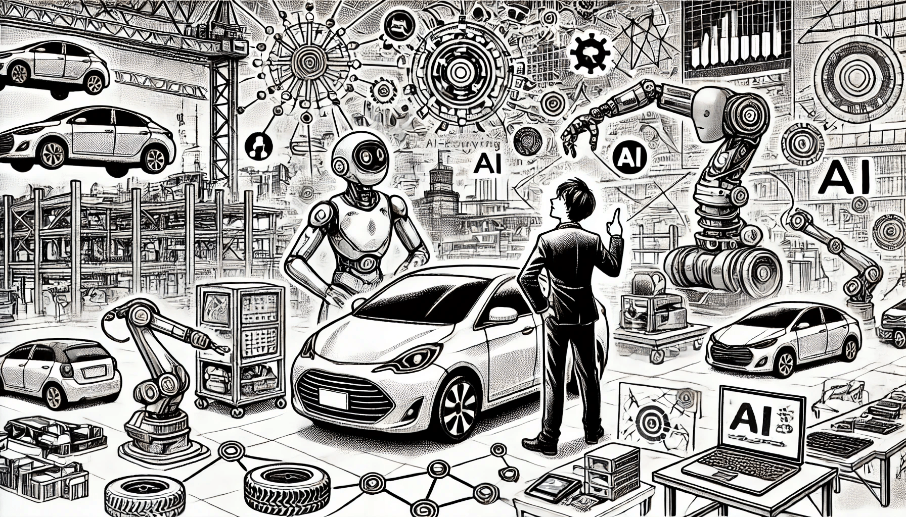

# ИИ в автомобильной промышленности

### Движущая сила будущего мобильности

Искусственный интеллект стал ключевым элементом трансформации в автомобильной индустрии, расширяя горизонты инноваций до уровня, который еще недавно казался невозможным. От автономного вождения до улучшения производственных процессов и более интеллектуальных систем в автомобилях — ИИ меняет подход к проектированию, производству и эксплуатации транспортных средств. Давайте рассмотрим основные направления, в которых ИИ оказывает значительное влияние на автомобильную отрасль.

<figure><figcaption>
ИИ в автомобильной промышленности
</figcaption></figure>

### Автономное вождение

Наиболее известное и амбициозное применение ИИ в автомобильной индустрии — это разработка автономных транспортных средств, также известных как беспилотные автомобили. Эти машины полагаются на сложную систему алгоритмов ИИ, датчиков, камер и радаров, чтобы воспринимать окружающую среду, принимать решения и управлять автомобилем с минимальным или полным отсутствием вмешательства человека.&#x20;

Компания **Tesla** является лидером в этой области, интегрировав ИИ в свои системы Autopilot и Full Self-Driving (FSD). Автомобили Tesla обрабатывают данные с множества датчиков в реальном времени, что позволяет им управлять движением, менять полосы, парковаться и даже ориентироваться в городских условиях с минимальным участием водителя. Другие компании, такие как **Waymo** (дочерняя компания Alphabet), также тестируют полностью автономные такси, которые используют ИИ для передвижения по определенным городским районам, обучаясь на новых дорожных ситуациях. Цель — снижение количества аварий, повышение безопасности и доступности транспорта.

### Передовые системы помощи водителю (ADAS)

Хотя полностью автономные автомобили все еще находятся в стадии разработки, ИИ уже улучшает опыт вождения с помощью передовых систем помощи водителю (ADAS). Эти системы используют ИИ, чтобы помочь водителям с функциями, такими как автоматическое торможение, удержание в полосе, адаптивный круиз-контроль и предотвращение столкновений.&#x20;

Например, компании **Mercedes-Benz** и **BMW** внедрили в свои автомобили системы ADAS на базе ИИ, которые предоставляют водителям информацию в режиме реального времени. Эти системы постоянно анализируют данные с камер и датчиков, обнаруживая потенциальные опасности, такие как резкие остановки впереди и непреднамеренные выезды из полосы. Это создает более безопасные условия на дороге, предотвращая аварии до их возникновения.

### ИИ в производстве и сборке&#x20;

ИИ оказывает значительное влияние на производственные линии автомобильной промышленности, делая их более эффективными и экономичными. Роботы, управляемые ИИ, выполняют сложные задачи, такие как сварка, покраска и сборка, требующие высокой точности и постоянства.&#x20;

Компания **Toyota** использует роботов, работающих на основе ИИ, для оптимизации своего производственного процесса. Эти роботы могут адаптироваться к различным задачам, обучаясь в процессе работы, что делает их более гибкими по сравнению с традиционными промышленными машинами. ИИ также используется для контроля качества, где алгоритмы машинного обучения способны проверять детали на наличие дефектов быстрее и точнее, чем люди. Это гарантирует, что автомобили, покидающие завод, соответствуют высоким стандартам качества.

### Интеллектуальные ассистенты в автомобилях&#x20;

ИИ также проник внутрь автомобилей, улучшая пользовательский опыт с помощью интеллектуальных ассистентов. Эти системы, такие как **Amazon Alexa Auto** или **Apple CarPlay**, предоставляют водителям голосовые команды для управления навигацией, развлечениями и диагностики автомобиля.&#x20;

Например, **интеллектуальный помощник BMW** использует технологии обработки естественного языка, чтобы водители могли управлять функциями автомобиля через голосовые команды, такими как настройка температуры или запрос маршрута. Более того, такие системы могут запоминать предпочтения водителя и предлагать персонализированные решения, например, автоматически подстраивать положение сидений или выбирать оптимальные маршруты.

### ИИ в проектировании и инновациях автомобилей

ИИ ускоряет инновации в проектировании автомобилей, помогая инженерам создавать более эффективные, безопасные и экологически чистые транспортные средства. Путем моделирования условий вождения и анализа данных о реальном использовании, ИИ помогает дизайнерам лучше понять, как различные материалы, аэродинамика и технологии будут работать на практике.&#x20;

Компании, такие как **General Motors (GM)**, используют ИИ для создания более аэродинамичных конструкций автомобилей, что улучшает топливную экономичность и снижает выбросы. ИИ также позволяет виртуально тестировать новые системы безопасности, проводя краш-тесты в цифровом формате еще до создания физических прототипов, что экономит время и ресурсы на стадии разработки.

### ИИ и электромобили

ИИ играет ключевую роль в развитии и оптимизации электромобилей (EV). Алгоритмы ИИ помогают оптимизировать работу батарей, управлять потреблением энергии и даже предсказывать доступность зарядных станций на основе данных в реальном времени.&#x20;

Например, **Tesla** использует ИИ для повышения эффективности своих аккумуляторов. Система обучается на основе данных о поведении водителей, регулируя скорость зарядки и оптимизируя энергопотребление в зависимости от условий вождения. ИИ также помогает сети Tesla Supercharger, предсказывая, какие станции зарядки будут наиболее востребованы, и направляя водителей к доступным локациям.

### Будущее автомобильной индустрии с ИИ

Интеграция ИИ в автомобильную отрасль меняет подход к созданию, эксплуатации и обслуживанию автомобилей. От автономного вождения и интеллектуальных ассистентов до предиктивного обслуживания и передовых методов производства — ИИ ведет отрасль к будущему с более безопасными, эффективными и умными транспортными средствами. По мере развития технологий ИИ автомобильный ландшафт продолжит трансформироваться, открывая новые возможности для мобильности и инноваций.
