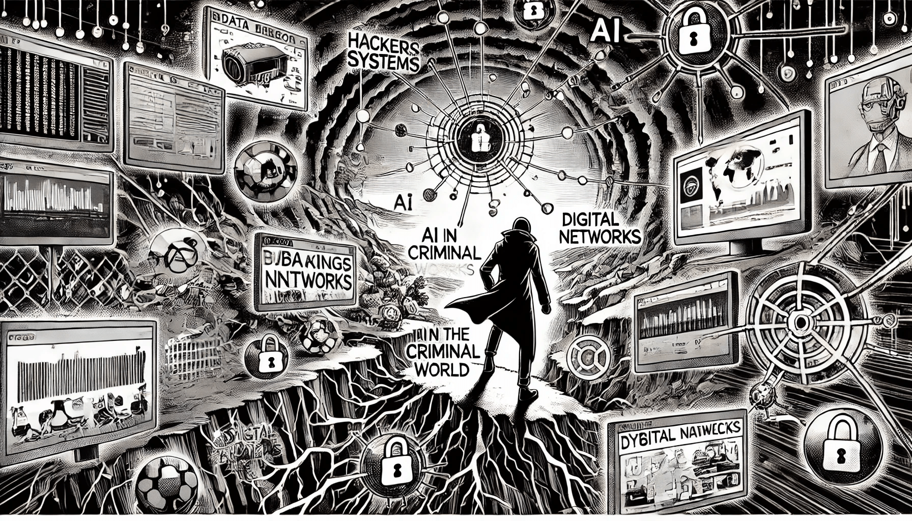

# ИИ в криминальном мире

### Новый инструмент для преступной деятельности

Хотя ИИ приносит пользу во многих сферах, он также попал в руки преступников, которые используют его возможности для масштабирования, усложнения и повышения анонимности своих незаконных действий. Появление инструментов на базе ИИ создало новые вызовы в киберпреступности, мошенничестве и даже физической безопасности, усложняя для правоохранительных органов борьбу с быстро развивающимися угрозами.

<figure><figcaption>
ИИ в криминальном мире
</figcaption></figure>

### Киберпреступность с использованием ИИ

ИИ все чаще применяется для усиления кибератак, автоматизируя такие процессы, как фишинг, создание вредоносного ПО и проникновение в системы. С помощью ИИ киберпреступники могут более точно выбирать жертв, создавая высокоперсонализированные фишинговые письма, которые сложно обнаружить и определить как фишинговые. Эти атаки на основе ИИ адаптируются, учась на ошибках и изменяя тактику, делая традиционные защитные методы менее эффективными.

Например, вредоносное ПО на основе ИИ может избегать обнаружения, динамически изменяя свой код, чтобы обойти антивирусное ПО, создавая более устойчивую и развивающуюся угрозу. Точно так же ИИ можно использовать для взлома паролей методом перебора, где алгоритмы систематически подбирают все возможные комбинации с такой скоростью и эффективностью, которых не может достичь ни один человек.

### Мошенничество и манипуляции с помощью дипфейков

Дипфейки, созданные с помощью ИИ, стали серьезной проблемой в криминальном мире. Технология дипфейков позволяет ИИ создавать чрезвычайно реалистичные поддельные видео, изображения или аудиозаписи, способные имитировать конкретных людей с поразительной точностью. Преступники используют дипфейки для создания поддельных видео или записей, чтобы манипулировать ситуациями — от имитации голосов руководителей компаний в корпоративных мошенничествах до фальшивых сообщений в схемах шантажа.

В одном известном случае ИИ использовался для имитации голоса генерального директора в мошенническом звонке, который убедил компанию перевести крупную сумму денег. С ростом сложности дипфейков они становятся все более серьезной угрозой для личной приватности, финансовой безопасности и общественного доверия.

### Автоматизированные взломы и эксплуатация

ИИ может обнаруживать уязвимости в системах быстрее, чем это могут делать хакеры, что позволяет проводить крупномасштабные автоматизированные кибератаки. Инструменты взлома на базе ИИ способны сканировать сети и программное обеспечение на наличие слабых мест и использовать их в невиданном ранее масштабе. Как только уязвимость обнаружена, ИИ может начать целенаправленные атаки, иногда даже одновременно проводя несколько атак, что может перегрузить стандартные системы кибербезопасности.

Преступные организации уже начали использовать ИИ в “ботнетах” — сетях взломанных устройств, которыми удаленно управляют хакеры. Эти ботнеты на базе ИИ могут выполнять масштабные кибератаки, такие как атаки распределенного отказа в обслуживании (DDoS), которые перегружают системы и веб-сайты, вызывая их сбои или требуя выкупа за восстановление.

### ИИ в наркоторговле и контрабанде

ИИ также находит применение в традиционных преступных действиях, таких как наркоторговля и контрабанда. Преступники используют ИИ для оптимизации маршрутов, прогнозирования действий правоохранительных органов и избегания обнаружения. Например, наркокартели используют дроны и автономные транспортные средства на базе ИИ для транспортировки нелегальных веществ через границы, снижая риск их выявления людьми.

Модели машинного обучения также используются для анализа данных и прогнозирования наилучшего времени и мест для контрабанды, основываясь на патрульных маршрутах и других внешних факторах. Это увеличивает эффективность контрабандных операций и усложняет для властей отслеживание и перехват нелегальных грузов.

### ИИ и финансовое мошенничество

ИИ используется для облегчения более сложных схем финансового мошенничества, от автоматизированного кражи личных данных до отмывания денег. Преступники применяют ИИ для анализа финансовых систем, поиска лазеек и автоматизации перевода нелегальных средств через границы. ИИ также может создавать синтетические личности, объединяя реальные и фальшивые данные для обхода финансовых проверок безопасности и открытия фальшивых счетов.

Например, ИИ может имитировать поведение реальных клиентов, что позволяет преступникам совершать мошеннические транзакции, не вызывая подозрений. Автоматизируя эти процессы, ИИ позволяет преступникам действовать в большем масштабе и с большей анонимностью, что затрудняет для финансовых учреждений выявление и предотвращение мошенничества.

### Будущее преступной деятельности с ИИ

Использование ИИ в преступном мире подчеркивает его двойственность: хотя он обладает огромным потенциалом для положительных изменений, он также открывает новые возможности для злоупотреблений. По мере развития ИИ будет эволюционировать и его применение в преступной деятельности, требуя от правоохранительных органов и служб кибербезопасности постоянного совершенствования для борьбы с возникающими угрозами.
