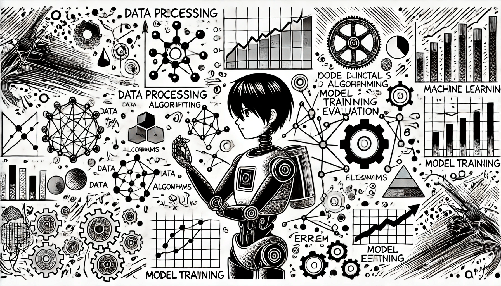

# Ключевые принципы

### Основные принципы машинного обучения

<figure><figcaption>
Ключевые принципы МО
</figcaption></figure>

#### Обучение на основе данных

Машинное обучение строится на данных. Чем больше данных мы имеем, тем лучше модель может учиться. Данные помогают модели выявлять закономерности и делать прогнозы.

#### Модель

Модель — это ядро машинного обучения. Это математическая структура, которую система создаёт, обучаясь на данных. После обучения модель использует полученные знания для предсказания результатов или классификации информации.

#### Обучение

Во время обучения модель работает с набором данных (называемым тренировочным набором), где известны как входные данные, так и ожидаемые выходные результаты. Модель использует эти данные, чтобы настраивать свои параметры и учиться делать точные прогнозы. Цель обучения — минимизировать ошибки при предсказаниях.

#### Тестирование

После обучения модель тестируется на другом наборе данных (тестовом), чтобы проверить, как хорошо она справляется с новыми, ранее невиданными данными. Это помогает оценить точность и надёжность модели.

### Признаки и метки

Признаки — это входные данные, на основе которых делаются предсказания. Например, если мы прогнозируем стоимость дома, такие характеристики, как его площадь, количество комнат и местоположение, будут являться признаками.

Метки — это выходные данные, которые мы пытаемся предсказать. В случае с домами меткой будет реальная цена дома.

### Как работает машинное обучение

1\. **Сбор данных**: Вы собираете набор данных, связанных с задачей, которую хотите решить.

2\. **Обучение модели**: Алгоритм машинного обучения использует эти данные для выявления закономерностей. Во время обучения модель настраивает свои внутренние параметры для повышения точности предсказания.

3\. **Тестирование модели**: После обучения модель проверяется на новых данных, чтобы понять, насколько точно она делает прогнозы.

4\. **Прогнозирование**: После того как модель обучена и протестирована, она может делать предсказания на новых, ранее неизвестных (новых) данных.

### Основные термины

* **Переобучение**: Это происходит, когда модель слишком хорошо учится на тренировочных данных, включая шум и случайные колебания. В результате она может плохо работать на новых данных.
* **Недообучение**: Возникает, когда модель слишком проста и не способна уловить все закономерности в данных.
* **Точность**: Показатель того, как часто модель делает правильные прогнозы.

Понимание этих базовых принципов поможет вам начать исследование того, как машинное обучение решает реальные задачи, находя закономерности и делая прогнозы на основе данных.
