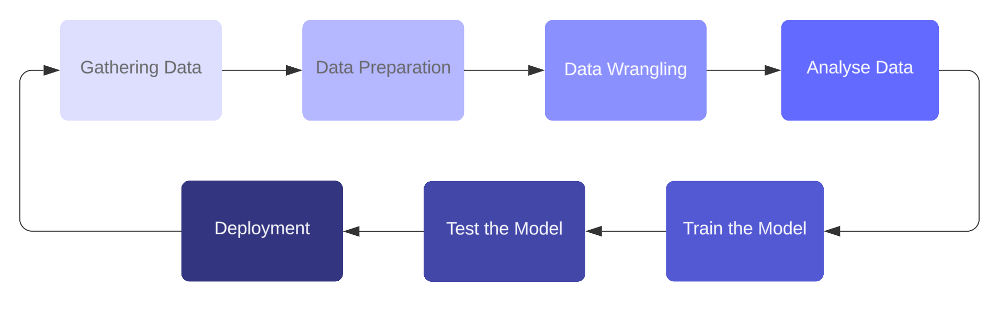

# Жизненный цикл машинного обучения

Давайте погрузимся в увлекательный мир машинного обучения через его жизненный цикл — процесс, который позволяет компьютерам учиться самостоятельно, без явного программирования. Но как же происходит вся эта магия? Представьте себе это как поэтапное путешествие, которое превращает сырые данные в интеллектуальные системы. Весь смысл жизненного цикла машинного обучения — это найти решение проблемы, создавая эффективную модель, подобно тому, как мастер изготавливает из сырого материла идеальный инструмент для конкретной задачи.

<figure><figcaption>
Жизненный цикл машинного обучения
</figcaption></figure>

Теперь давайте разберем ключевые этапы этого пути:

### 1. Сбор данных: топливо для машинного обучения

Прежде чем мы сможем научить машину учиться, нам нужно «накормить» её информацией — и чем больше, тем лучше. Данные — это топливо для машинного обучения. Мы собираем их из различных источников: баз данных, файлов, веб-сайтов или даже мобильных устройств. Чем больше данных мы соберём, тем точнее машина сможет делать предсказания. Однако важен не только объём данных — их качество также имеет значение!

### 2. Подготовка данных: организация хаоса

После того как данные собраны, нужно подготовить их к работе. Этот этап — про то, как разместить данные на своих местах и убедиться, что они в хорошем состоянии. Мы перемешиваем данные, рандомизируем их и начинаем их изучать. Это помогает нам понять общие тенденции, закономерности и выявить возможные аномалии.

### 3. Обработка данных: наведение порядка

Реальные данные могут быть довольно «грязными» — с пропущенными значениями, дубликатами или нерелевантной информацией. Обработка данных — это как уборка перед важным мероприятием. Мы их очищаем, выбираем нужные переменные и преобразуем их в формат, готовый к анализу. Это гарантирует, что модель будет работать с наилучшими данными.

### 4. Анализ данных: создание чертежа

Теперь, когда данные очищены, пора их анализировать. На этом этапе мы выбираем, какие техники машинного обучения использовать, например, классификацию или регрессию, в зависимости от того, какую задачу мы пытаемся решить. Представьте это как создание чертежа для вашей модели машинного обучения. Вы проектируете структуру, которая скоро будет управлять всей системой.

### 5. Обучение модели: фаза обучения

Вот где начинается магия! Модель начинает процесс обучения. Мы подаём в неё данные и учим систему распознавать закономерности, правила и особенности. Как студент, который учится на примерах, машина улучшает своё понимание того, как справляться с аналогичными проблемами в будущем.

### 6. Тестирование модели: время экзамена

После того как модель обучена, её нужно протестировать! Мы предоставляем ей новый набор данных, чтобы посмотреть, как она справится. Тестирование помогает нам измерить точность модели и понять, готова ли она к реальной работе. Если модель проходит тест с отличными результатами, значит, мы на верном пути.

### 7. Развертывание: запуск модели в работу

И наконец, мы достигаем этапа развертывания — когда модель начинает работать в реальной жизни. Если всё функционирует так, как ожидалось, и выдаёт точные результаты, модель интегрируется в реальную систему. Этот шаг похож на представление финальной версии проекта — всё должно быть отполировано и работать безупречно.

На протяжении всего жизненного цикла ключ к успеху — это понимание проблемы, которую вы пытаетесь решить. Каждое решение, от сбора данных до развертывания модели, основано на глубоком понимании стоящей задачи. И в этом суть машинного обучения — сочетание данных, технологий и аналитики для создания систем, которые учатся и адаптируются со временем.

### Диаграмма жизненного цикла

Для лучшего понимания ниже приведена диаграмма, иллюстрирующая жизненный цикл машинного обучения.

<figure><figcaption></figcaption></figure>
